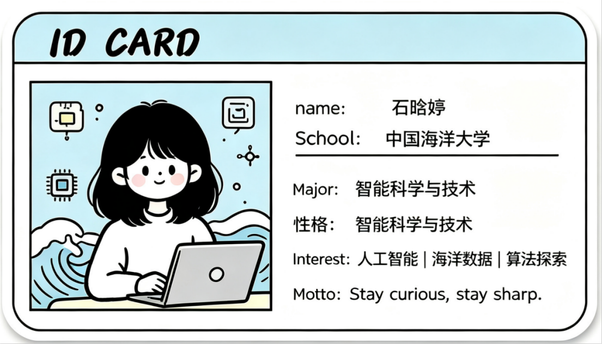
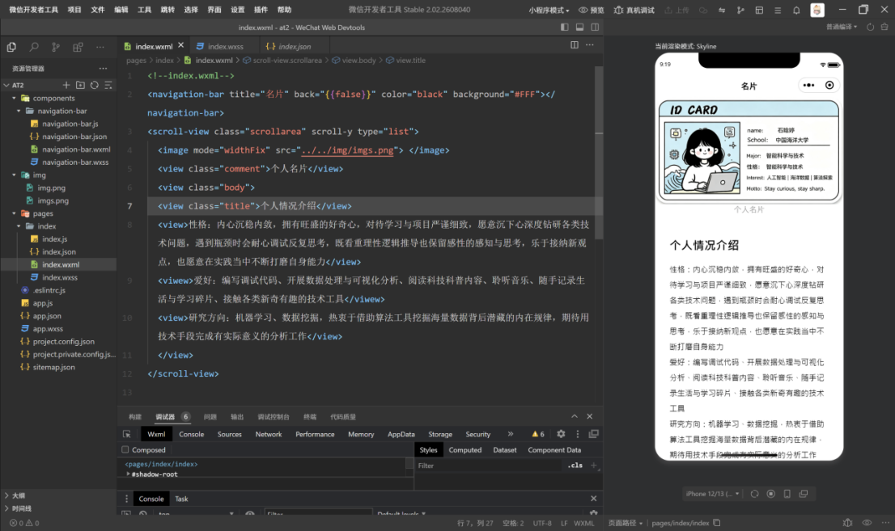
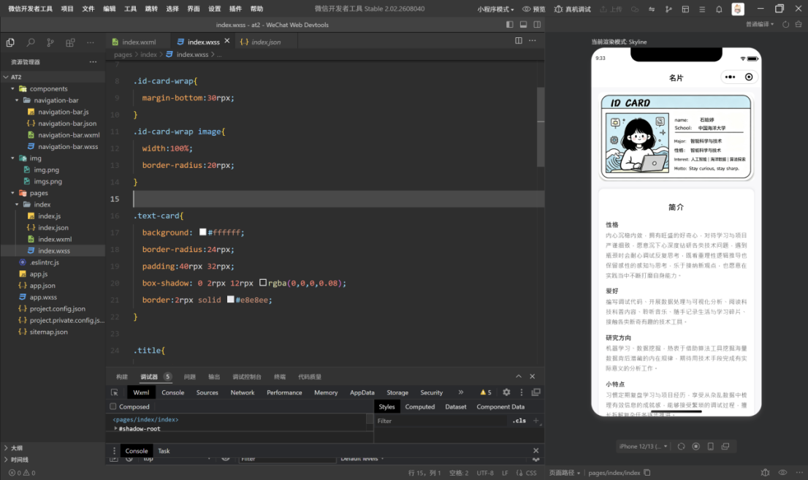
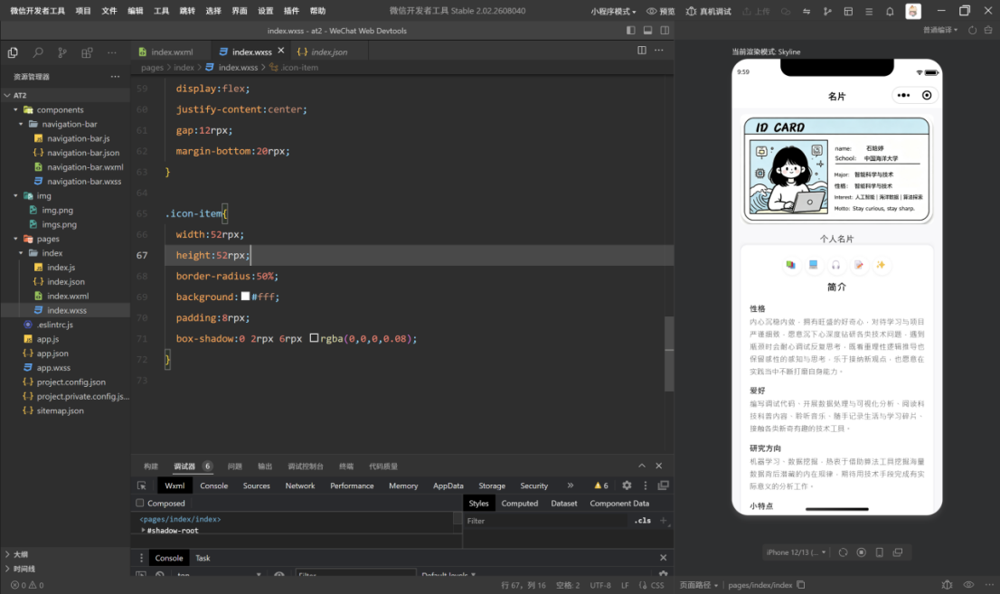
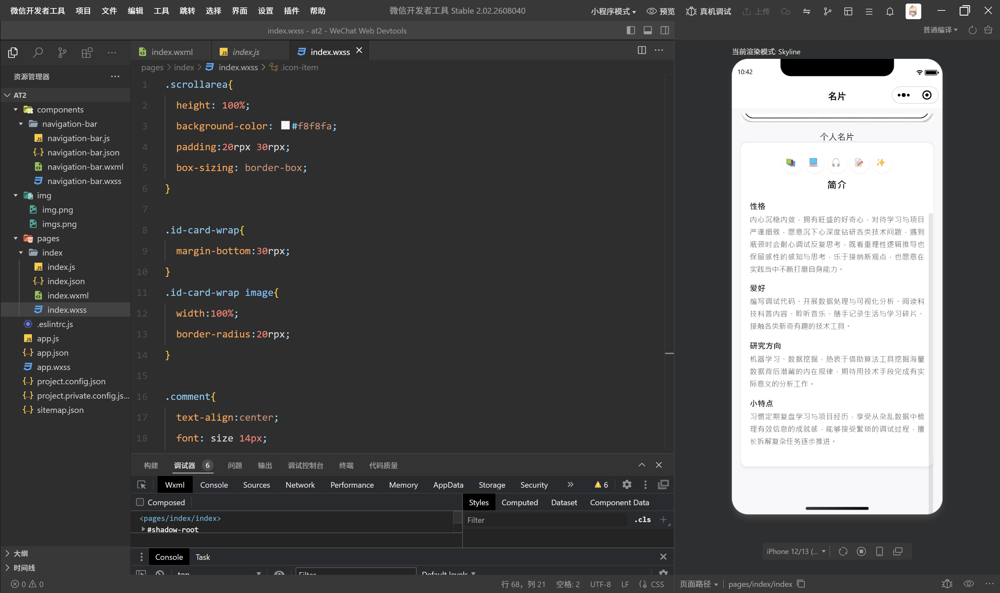

| ---- | ---- |
| 本实验属于哪门课程 | 中国海洋大学26夏《移动软件开发》 |
| 实验名称 | 实验2：名片小程序 |
| 博客地址 |  |
| 代码仓库地址 |  |
## 一、实验内容 

### 1、实验流程

首先ai生成设计图，将设计图调整为自己喜欢的风格



调整图片的布局，保证图片处于合适的位置

代码如下：

```
<image mode="widthFix" src="../../img/imgs.png"></image>
```

```
/**图片铺满**/
.id-card-wrap image{
  width:100%;
  border-radius:20rpx;
}
```

之后将文字输入

```
<view>文字</view>
```

可以得到简单的版本如下图所示



具体更详细的代码实现见如下链接https://developers.weixin.qq.com/community/business/doc/000c869e5c46586bd688cd6175fc0d

### 2、改进

上面只是简单地实现了介绍，后面对排版进行调整，使自己的个人名片更加美观，将内容分块处理，同时加上边框处理。



代码如下：

文字分段处理

```
</view>
    <view class="title">简介</view>
    <view class="item">
      <view class="label">性格</view>
      <view class="content">内心沉稳内敛，拥有旺盛的好奇心，对待学习与项目严谨细致，愿意沉下心深度钻研各类技术问题，遇到瓶颈时会耐心调试反复思考，既看重理性逻辑推导也保留感性的感知与思考，乐于接纳新观点，也愿意在实践当中不断打磨自身能力。</view>
    </view>
    <view class="item">
      <view class="label">爱好</view>
      <view class="content">编写调试代码、开展数据处理与可视化分析、阅读科技科普内容、聆听音乐、随手记录生活与学习碎片、接触各类新奇有趣的技术工具。</view>
    </view>
    <view class="item">
      <view class="label">研究方向</view>
      <view class="content">机器学习、数据挖掘，热衷于借助算法工具挖掘海量数据背后潜藏的内在规律，期待用技术手段完成有实际意义的分析工作。</view>
    </view>
    <view class="item">
      <view class="label">小特点</view>
      <view class="content">习惯定期复盘学习与项目经历，享受从杂乱数据中梳理有效信息的成就感，能够接受繁琐的调试过程，擅长拆解复杂任务逐步推进。</view>
    </view>
    <view class="item">
    </view>
  </view>
```

文字格式调整

```
.id-card-wrap{
  margin-bottom:30rpx;
}
.id-card-wrap image{
  width:100%;
  border-radius:20rpx;
}

.comment{
  text-align:center;
  font: size 14px;
  columns: #999;
}

.text-card{
  background: #ffffff;
  border-radius:24rpx;
  padding:40rpx 32rpx;
  box-shadow: 0 2rpx 12rpx rgba(0,0,0,0.08);
  border:2rpx solid #e8e8ee;
}

.title{
  font-size:34rpx;
  font-weight:bold;
  text-align:center;
  margin: 20rpx 0 36rpx 0;
  letter-spacing:2rpx;
}


.item{
  margin-bottom:28rpx;
}
.item:last-child{
  margin-bottom:0;
}

.label{
  font-size:28rpx;
  font-weight:600;
  color:#333;
  margin-bottom:8rpx;
}
.content{
  font-size:26rpx;
  color:#555;
  line-height:1.7;
  text-align:justify;
}
```

### 3、增加图标

整体框架完成以后，可以在一些部分增加图标，通过图标加入小图案（这里也可以用导入图片插入想要的图片），具体的效果如下所示



代码实现如下：

```
<view class="text-card">
    <view class="icon-row">
    <view class="icon-item">📚</view>
    <view class="icon-item">💻</view>
    <view class="icon-item">🎧</view>
    <view class="icon-item">📝</view>
    <view class="icon-item">✨</view>
  </view>
```

图标的位置可以替换成其他图案

格式调整

```
.icon-row{
  display:flex;
  justify-content:center;
  gap:12rpx;
  margin-bottom:20rpx;
}

.icon-item{
  width:52rpx;
  height:52rpx;
  border-radius:50%;
  background:#fff;
  padding:8rpx;
  box-shadow:0 2rpx 6rpx rgba(0,0,0,0.08);
}
```

并且具有滚动处理，具有更好的视觉效果和体验



## 二、问题总结与体会 描述实验过程中所遇到的问题，以及是如何解决的。有哪些收获和体会，对于课程的安排有哪些建议。

### 问题1：

图片与下方的文字没有距离，不美观，调整图片和间距达到合适的效果

代码实现如下

```
.id-card-wrap{
  margin-bottom: 48rpx;
}
.id-card-wrap image{
  width:100%;
  border-radius:20rpx;
}
```

### 收获和体会

对文字的排版有了一定的理解，文字的间距，图片的大小以及颜色的搭配都需要调整才能得到好的效果。
