<center>姓名：石晗婷  学号：24020007103</center> 


| 姓名和学号         | 石晗婷，2402007103               |
| ------------------ | -------------------------------- |
| 本实验属于哪门课程 | 中国海洋大学26夏《移动软件开发》 |
| 实验名称           | 实验3：高校新闻网                |
| 博客地址           | XXXXX（选做）                    |

### 一、实验内容

#### 1、基础实验步骤

##### 1，首页

首先设置基本的页面。

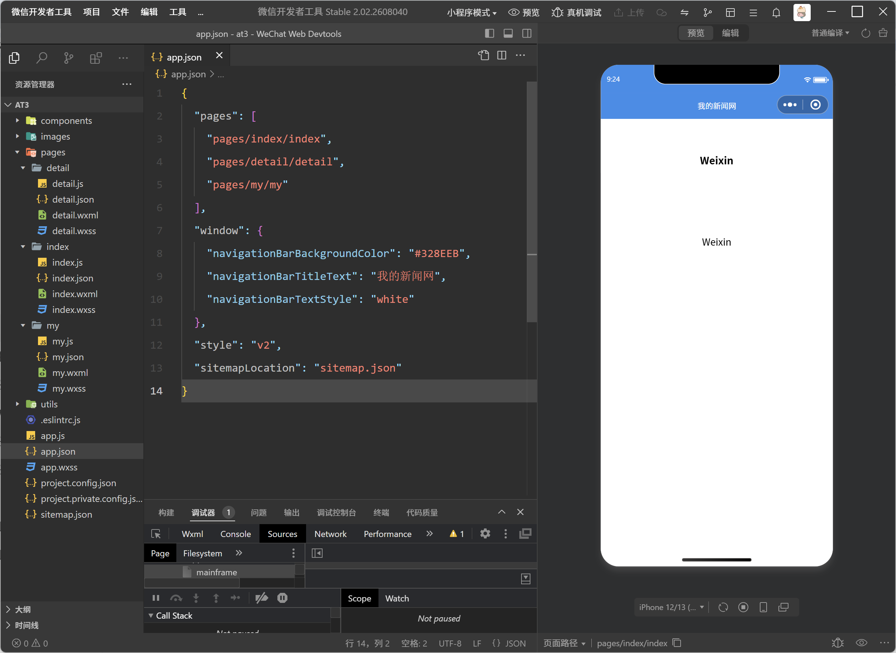

代码实现如下：

```
{
  "pages": [
    "pages/index/index",
    "pages/detail/detail",
    "pages/my/my"
  ],
  "window": {
    "navigationBarBackgroundColor": "#328EEB",
    "navigationBarTitleText": "我的新闻网",
    "navigationBarTextStyle": "white"
  },
  "style": "v2",
  "sitemapLocation": "sitemap.json"
}
```

导入图片到首页的位置，实现轮播的效果。

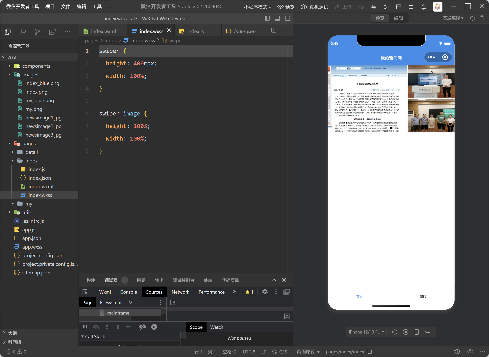

实现代码如下：

index.wxml：

```
<swiper
  indicator-dots="true"
  autoplay="true"
  interval="5000"
  duration="500"
>
  <view wx:for="{{swiperImg}}" wx:key="index">
    <swiper-item>
      <image src="{{item.src}}"></image>
    </swiper-item>
  </view>
</swiper>
```

index.wxss

```
swiper {
  height: 400rpx;
  width: 100%;
}

swiper image {
  height: 100%;
  width: 100%;
}
```

index.js

```
Page({

  data: {

    swiperImg: [
      {
        src: '/images/newsimage1.jpg'
      },
      {
        src: '/images/newsimage2.jpg'
      },
      {
        src: '/images/newsimage3.jpg'
      }
    ]

  }

})
```


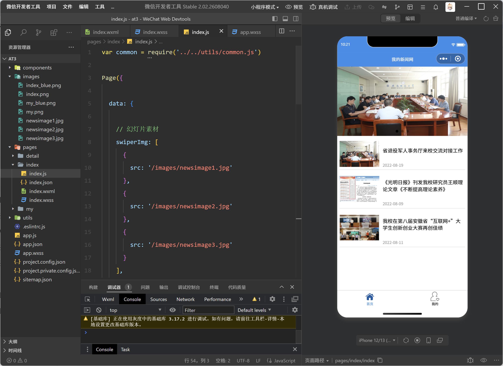

页面设计：

index.wxml:在 `index.wxml` 中使用 `swiper` 实现三张新闻图片自动轮播，并使用 `wx:for` 遍历 `newsList` 生成新闻列表；在 `index.wxss` 中设置轮播图尺寸，在 `app.wxss` 中设置新闻列表公共样式。

```
<!-- 幻灯片 -->
<swiper
  indicator-dots="true"
  autoplay="true"
  interval="5000"
  duration="500"
>
  <block wx:for="{{swiperImg}}" wx:key="index">
    <swiper-item>
      <image src="{{item.src}}"></image>
    </swiper-item>
  </block>
</swiper>

<!-- 新闻列表 -->
<view class="news-list">

  <view
    class="news-item"
    wx:for="{{newsList}}"
    wx:key="id"
    bindtap="goToDetail"
    data-id="{{item.id}}"
  >

    <image src="{{item.poster}}"></image>

    <view class="news-info">

      <text class="news-title">
        {{item.title}}
      </text>

      <text class="news-date">
        {{item.add_date}}
      </text>

    </view>

  </view>

</view>
```

index.wxss:

```
/* 幻灯片 */
swiper {
  height: 400rpx;
  width: 100%;
}

swiper image {
  height: 100%;
  width: 100%;
}
```

index.js:

通过  `require('../../utils/common.js')  `引用老师提供的公共 JS 文件，并在  `onLoad  `生命周期函数中调用新闻列表获取函数，将数据通过 ` setData()  `赋值给  `newsList `。最后，为每条新闻绑定点击事件

```
var common = require('../../utils/common.js')

Page({

  data: {

    // 幻灯片素材
    swiperImg: [
      {
        src: '/images/newsimage1.jpg'
      },
      {
        src: '/images/newsimage2.jpg'
      },
      {
        src: '/images/newsimage3.jpg'
      }
    ],

    // 新闻列表
    newsList: []

  },
  onLoad: function (options) {

    let list = common.getNewsList()

    this.setData({
      newsList: list
    })

  },

  goToDetail: function (e) {

    let id = e.currentTarget.dataset.id

    wx.navigateTo({
      url: '../detail/detail?id=' + id
    })

  }

})
```

app.wxss:

为每条新闻绑定点击事件，通过 `data-id` 获取新闻编号，并使用 `wx.navigateTo()` 将新闻 ID 传递到 `detail` 页面，为后续新闻详情显示做好准备。

```
/* 新闻列表 */
.news-list {
  min-height: 600rpx;
  padding: 15rpx;
}

.news-item {
  display: flex;
  flex-direction: row;
  align-items: center;

  padding: 10rpx 0;

  border-bottom: 1rpx solid #dddddd;
}

.news-item image {
  width: 230rpx;
  height: 150rpx;

  margin-right: 20rpx;

  flex-shrink: 0;
}

.news-info {
  flex: 1;

  display: flex;
  flex-direction: column;
  justify-content: space-between;

  min-height: 130rpx;
}

.news-title {
  font-size: 30rpx;
  line-height: 42rpx;
}

.news-date {
  margin-top: 15rpx;

  font-size: 24rpx;
  color: #999999;
}
```

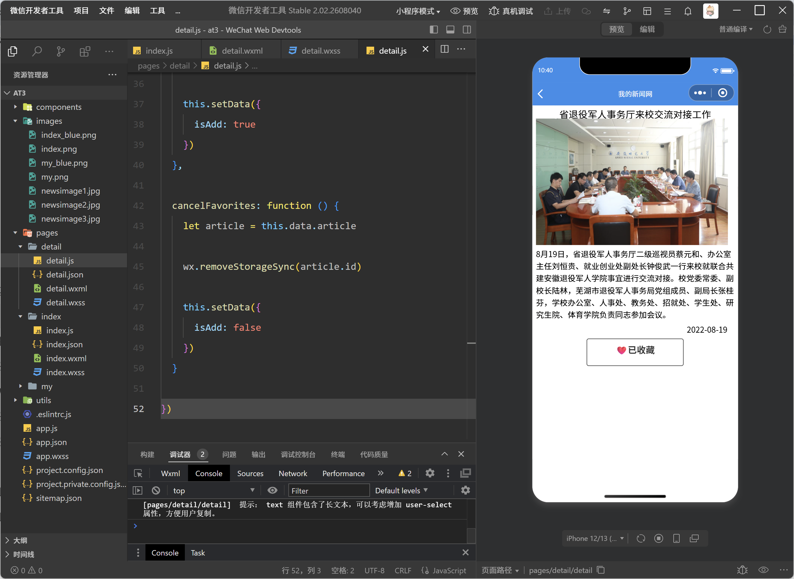

detail.wxml:

```
<view class="container">
  <view class="title">{{article.title}}</view>

  <view class="poster">
    <image src="{{article.poster}}"></image>
  </view>

  <view class="content">
    <text>{{article.content}}</text>
  </view>

  <view class="add_date">{{article.add_date}}</view>

  <button wx:if="{{isAdd}}" plain bindtap="cancelFavorites">
    ❤️已收藏
  </button>

  <button wx:else plain bindtap="addFavorites">
    ❤️未收藏
  </button>
</view>
```

detail.wxss:

```
.container {
  padding: 15rpx;
}

.title {
  font-size: 35rpx;
  line-height: 35rpx;
  text-align: center;
}

.poster image {
  width: 700rpx;
}

.content text {
  text-align: left;
  font-size: 30rpx;
  line-height: 35rpx;
}

.add_date {
  font-size: 30rpx;
  text-align: right;
  line-height: 30rpx;
  margin-right: 25rpx;
  margin-top: 20rpx;
}

button {
  width: 250rpx;
  height: 100rpx;
  margin: 20rpx auto;
}
```

detail.js:

```
var common = require('../../utils/common.js')

Page({

  data: {
    article: {},
    isAdd: false
  },

  onLoad: function (options) {
    let id = options.id

    let newArticle = wx.getStorageSync(id)

    if (newArticle != '') {
      this.setData({
        isAdd: true,
        article: newArticle
      })
    } else {
      let result = common.getNewsDetail(id)

      if (result.code == '200') {
        this.setData({
          article: result.news,
          isAdd: false
        })
      }
    }
  },

  addFavorites: function () {
    let article = this.data.article

    wx.setStorageSync(article.id, article)

    this.setData({
      isAdd: true
    })
  },

  cancelFavorites: function () {
    let article = this.data.article

    wx.removeStorageSync(article.id)

    this.setData({
      isAdd: false
    })
  }

})
```

##### 2、个人中心

接下来实现个人中心页面。个人中心读取本地缓存中的新闻，将已经收藏的新闻显示在“我的收藏”区域中，点击收藏新闻可以重新进入对应的新闻详情页。老师基础实验中的个人中心本身要求实现登录、收藏列表读取和点击收藏查看详情。

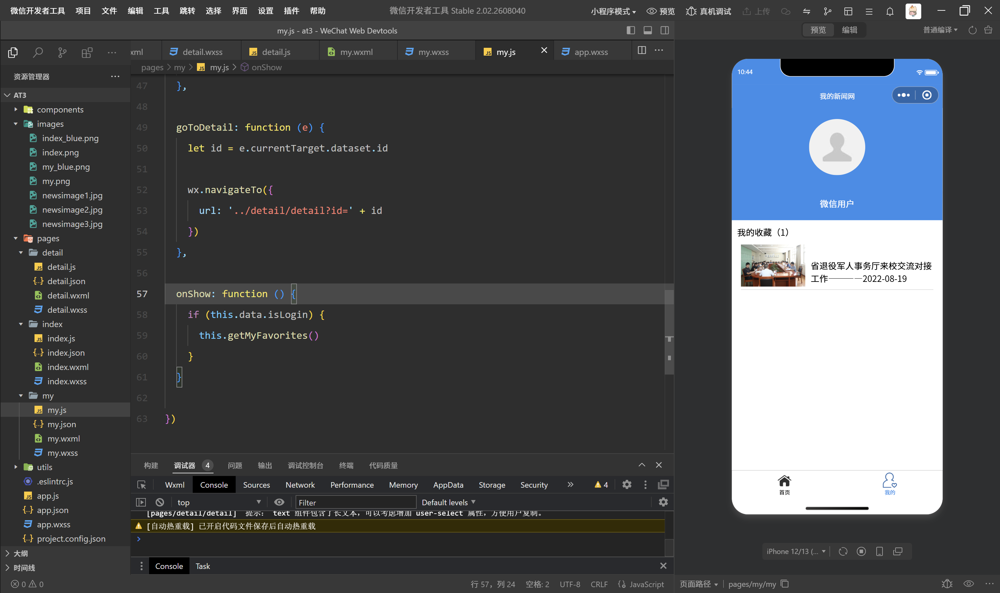

pages/my/my.wxml:

```
<view class="myLogin">

  <block wx:if="{{isLogin}}">
    <image src="{{src}}"></image>
    <text>{{nickName}}</text>
  </block>

  <button wx:else bindtap="getUserInfo">
    未登录，点此登录
  </button>

</view>

<view class="myFavorite">

  <text>我的收藏（{{number}}）</text>

  <view class="news-list">

    <view
      class="news-item"
      wx:for="{{newsList}}"
      wx:key="id"
      bindtap="goToDetail"
      data-id="{{item.id}}"
    >
      <image src="{{item.poster}}"></image>

      <text>
        {{item.title}}————{{item.add_date}}
      </text>
    </view>

  </view>

</view>
```

pages/my/my.wxss:

```
.myLogin {
  height: 400rpx;
  background-color: #328EEB;
  display: flex;
  flex-direction: column;
  align-items: center;
  justify-content: space-around;
}

.myLogin image {
  height: 200rpx;
  width: 200rpx;
  border-radius: 50%;
}

.myLogin text {
  color: white;
}

.myFavorite {
  padding: 20rpx;
}
```

pages/my/my.js:

```
Page({

  data: {
    isLogin: false,
    src: '',
    nickName: '',
    number: 0,
    newsList: []
  },

  getUserInfo() {
    let that = this

    wx.getUserProfile({
      desc: '用于完善用户资料',

      success(res) {
        res = res.userInfo

        that.setData({
          isLogin: true,
          src: res.avatarUrl,
          nickName: res.nickName
        })

        that.getMyFavorites()
      }
    })
  },

  getMyFavorites: function () {
    let info = wx.getStorageInfoSync()
    let keys = info.keys
    let num = keys.length

    let myList = []

    for (let i = 0; i < num; i++) {
      let obj = wx.getStorageSync(keys[i])
      myList.push(obj)
    }

    this.setData({
      newsList: myList,
      number: num
    })
  },

  goToDetail: function (e) {
    let id = e.currentTarget.dataset.id

    wx.navigateTo({
      url: '../detail/detail?id=' + id
    })
  },

  onShow: function () {
    if (this.data.isLogin) {
      this.getMyFavorites()
    }
  }

})
```

#### 2、改进

##### 1、搜索功能

在原有新闻列表基础上增加搜索框，可以根据新闻标题查找新闻。

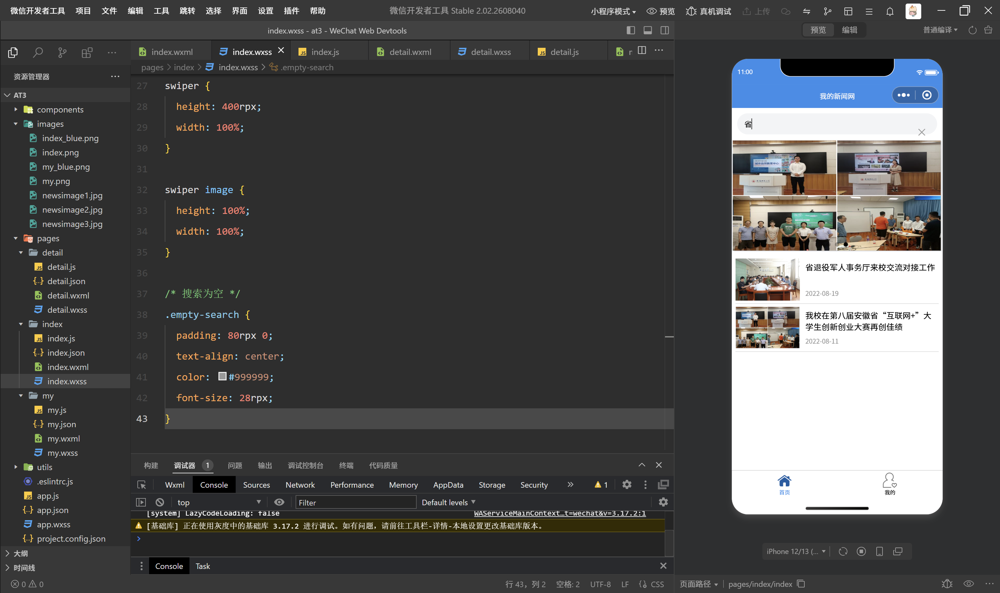

修改的代码为

pages/index/index.js：

在 `data` 里的：

```
newsList: []
```

改成：

```
newsList: [],
showNewsList: [],
keyword: ''
```

然后把 `onLoad` 中：

```
this.setData({
  newsList: list
})
```

改成：

```
this.setData({
  newsList: list,
  showNewsList: list
})
```

再在 `onLoad` 后面、`goToDetail` 前面加入：

```
onSearchInput: function (e) {
  let keyword = e.detail.value.trim()

  let result = this.data.newsList.filter(function (item) {
    return item.title.indexOf(keyword) !== -1
  })

  this.setData({
    keyword: keyword,
    showNewsList: result
  })
},

clearSearch: function () {
  this.setData({
    keyword: '',
    showNewsList: this.data.newsList
  })
},
```

pages/index/index.wxml

在轮播图 `<swiper>` 前面新增：

```
<view class="search-box">
  <input
    class="search-input"
    placeholder="搜索新闻标题"
    value="{{keyword}}"
    bindinput="onSearchInput"
  />

  <text
    wx:if="{{keyword}}"
    class="clear-search"
    bindtap="clearSearch"
  >
    ×
  </text>
</view>
```

然后找到新闻列表里的：

```
wx:for="{{newsList}}"
```

改成：

```
wx:for="{{showNewsList}}"
```

最后在 `.news-list` 里面、新闻循环结束后加入：

```
<view
  wx:if="{{showNewsList.length == 0}}"
  class="empty-search"
>
  没有找到相关新闻
</view>
```

pages/index/index.wxss：

在文件最后加入：

```
.search-box {
  margin: 20rpx;
  padding: 0 25rpx;
  height: 75rpx;
  background-color: #f3f4f6;
  border-radius: 40rpx;
  display: flex;
  align-items: center;
}

.search-input {
  flex: 1;
  height: 75rpx;
  font-size: 28rpx;
}

.clear-search {
  width: 60rpx;
  text-align: center;
  font-size: 40rpx;
  color: #999999;
}

.empty-search {
  padding: 80rpx 0;
  text-align: center;
  color: #999999;
  font-size: 28rpx;
}
```

##### 2、登录功能

改进个人中心登录功能

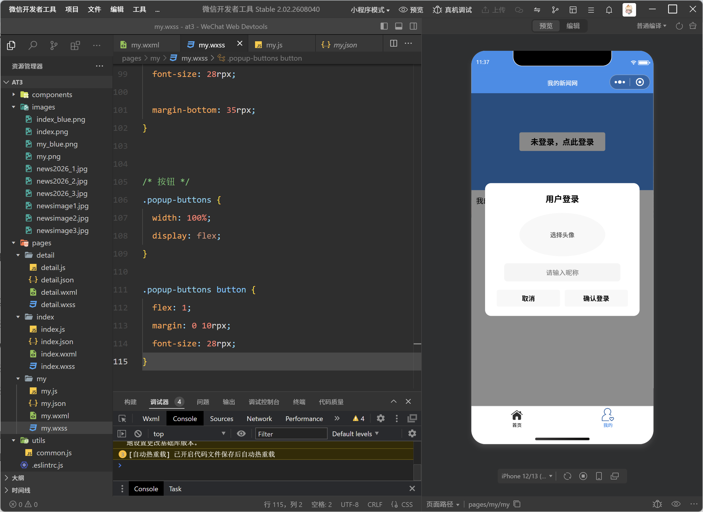

在原有个人中心登录功能基础上进行了改进。未登录状态下仍显示“未登录，点此登录”按钮，用户点击后不再直接登录，而是弹出登录窗口。用户可以在弹窗中自主选择头像、输入昵称，确认后完成登录。登录成功后，页面显示用户头像和昵称，同时读取并展示本地收藏新闻。

另外，在登录状态下新增“退出登录”按钮。用户点击后恢复到未登录状态，并清空当前页面显示的头像、昵称和收藏列表，但不会删除本地已经保存的收藏数据，因此再次登录后仍可继续查看原有收藏。

**代码实现如下：**

```
openLoginPopup: function () {
  this.setData({
    showLoginPopup: true
  })
},

closeLoginPopup: function () {
  this.setData({
    showLoginPopup: false
  })
},

onChooseAvatar: function (e) {
  this.setData({
    tempAvatar: e.detail.avatarUrl
  })
},

onNickNameInput: function (e) {
  this.setData({
    tempNickName: e.detail.value
  })
},

confirmLogin: function () {
  let avatar = this.data.tempAvatar
  let nickName = this.data.tempNickName.trim()

  if (!avatar) {
    wx.showToast({
      title: '请选择头像',
      icon: 'none'
    })
    return
  }

  if (!nickName) {
    wx.showToast({
      title: '请输入昵称',
      icon: 'none'
    })
    return
  }

  this.setData({
    isLogin: true,
    src: avatar,
    nickName: nickName,
    showLoginPopup: false
  })

  this.getMyFavorites()
},

logout: function () {
  this.setData({
    isLogin: false,
    src: '',
    nickName: '',
    tempAvatar: '',
    tempNickName: '',
    number: 0,
    newsList: []
  })
},
```

##### 3、首页小窗

更新新闻内容和新闻分类

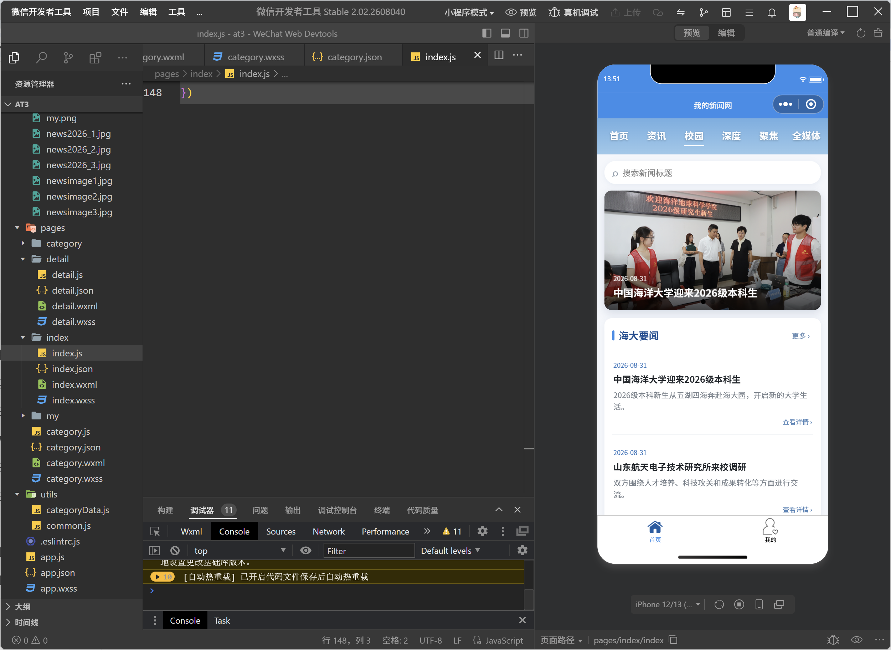

在完成基础新闻功能以后，对新闻数据进行了扩展，新建：

```
utils/categoryData.js
```

用于保存不同类型的新闻。

新闻的数据格式统一为：

```
{
  id: 'hdyw001',

  title: '新闻标题',

  add_date: '2026-08-31',

  category: '海大要闻',

  poster: '/images/新闻图片.jpg',

  summary: '新闻摘要',

  content: '新闻正文'
}
```

为了使顶部新闻栏目可以真正打开对应的新闻内容，新建：

```
pages/category
```

其中包括：

```
category.js
category.json
category.wxml
category.wxss
```

用户点击二级新闻栏目以后，通过：

```
wx.navigateTo()
```

进入分类页面。

代码实现如下：

```
onDropdownItemTap: function (e) {

  let name =
    e.currentTarget.dataset.name

  let parent =
    this.data.activeNav

  this.setData({
    showDropdown: false
  })

  wx.navigateTo({

    url:
      '../category/category?parent=' +
      encodeURIComponent(parent) +
      '&name=' +
      encodeURIComponent(name)

  })

},
```

分类页面读取传递过来的栏目名称：

```
var categoryData =
  require('../../utils/categoryData.js')

Page({

  data: {

    parent: '',

    categoryName: '',

    newsList: []

  },

  onLoad: function (options) {

    let parent =
      decodeURIComponent(
        options.parent || ''
      )

    let name =
      decodeURIComponent(
        options.name || ''
      )

    let list =
      categoryData
        .getCategoryNews(name)

    this.setData({

      parent: parent,

      categoryName: name,

      newsList: list

    })

    wx.setNavigationBarTitle({
      title: name
    })

  },

  goToDetail: function (e) {

    let id =
      e.currentTarget.dataset.id

    wx.navigateTo({
      url:
        '../detail/detail?id=' + id
    })

  }

})
```

新增以后，新闻不再只显示在首页中，点击不同栏目可以进入对应的分类页面。

##### 4、增加浏览历史功能

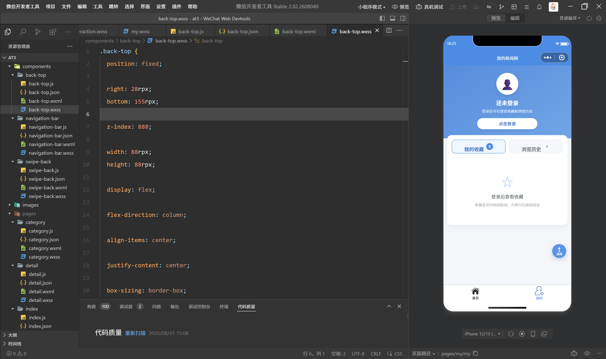

在个人中心的“我的收藏”旁边增加“浏览历史”。

每次用户打开一篇新闻时，自动将当前新闻保存到浏览历史。

代码实现如下：

```
saveReadingHistory: function (article) {

  if (!article || !article.id) {
    return
  }

  let history =
    wx.getStorageSync(
      '__reading_history__'
    )

  if (!Array.isArray(history)) {
    history = []
  }

  history =
    history.filter(
      function (item) {

        return item.id != article.id

      }
    )

  let now = new Date()

  let month =
    String(now.getMonth() + 1)
      .padStart(2, '0')

  let day =
    String(now.getDate())
      .padStart(2, '0')

  let hour =
    String(now.getHours())
      .padStart(2, '0')

  let minute =
    String(now.getMinutes())
      .padStart(2, '0')

  history.unshift({

    id: article.id,

    title: article.title,

    add_date:
      article.add_date || '',

    category:
      article.category || '新闻',

    view_time:
      month +
      '-' +
      day +
      ' ' +
      hour +
      ':' +
      minute

  })

  if (history.length > 20) {

    history =
      history.slice(0, 20)

  }

  wx.setStorageSync(
    '__reading_history__',
    history
  )

},
```

如果重复打开同一条新闻，先删除原来的记录，再把最新的一次浏览记录放在第一位，因此不会产生重复数据。

同时限制最多保存20条历史记录。

个人中心读取浏览历史：

```
getReadingHistory: function () {

  let history =
    wx.getStorageSync(
      '__reading_history__'
    )

  if (!Array.isArray(history)) {
    history = []
  }

  this.setData({

    historyList: history,

    historyNumber:
      history.length

  })

},
```

增加清空浏览历史：

```
clearHistory: function () {

  let that = this

  wx.showModal({

    title: '清空浏览历史',

    content:
      '确定清空全部浏览记录吗？',

    success: function (res) {

      if (res.confirm) {

        wx.removeStorageSync(
          '__reading_history__'
        )

        that.setData({

          historyList: [],

          historyNumber: 0

        })

      }

    }

  })

},
```

##### 5、增加回到顶部功能

对于新闻详情页和较长的新闻列表页面，增加一个悬浮的“回到顶部”按钮。

新建：

```
components/back-top
```

代码实现如下：

```
Component({

  methods: {

    backToTop: function () {

      wx.pageScrollTo({

        scrollTop: 0,

        duration: 350

      })

    }

  }

})
```

页面中增加：

```
<back-top></back-top>
```

点击按钮以后：

```
scrollTop: 0
```

将页面滚动位置恢复到最上方，

```
duration: 350
```

使返回顶部的过程具有平滑滚动效果。

## 问题

### 问题1

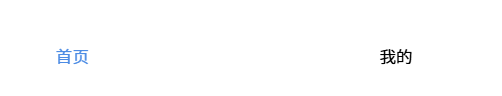

首页下面的图标不能进行展示

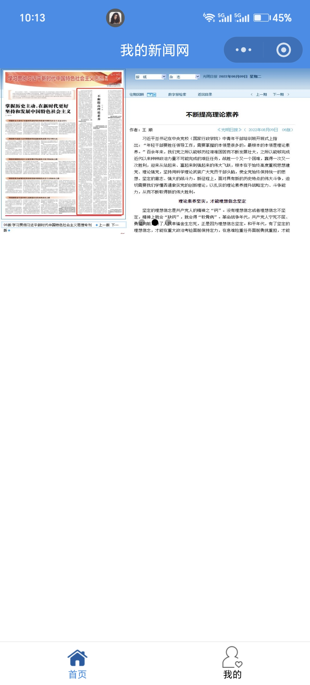


在手机上可以完整显示出来

### 问题2

在进行微信小程序真机预览和真机调试时，开发者工具提示上传失败，报错信息为：

```
source size 9775KB exceed max limit 2MB
```

为了解决这个问题，在项目根目录新增 `prepare_preview.ps1` 脚本，对 `images` 文件夹中的新闻图片进行统一压缩。处理时先将原始图片完整备份到项目外部文件夹，再对小程序项目中的图片进行尺寸和质量压缩，同时保持原有文件名和图片路径不变，因此不需要修改 `categoryData.js` 中的图片引用代码。

### 问题3

真机测试新闻收藏功能时发现，用户在没有登录个人中心的情况下，也可以直接进入新闻详情页并点击“收藏新闻”完成收藏。

出现该问题的原因是当前新闻收藏和登录功能之间没有建立判断关系。

新闻详情页中的收藏代码直接使用：

```
wx.setStorageSync(article.id, article)
```

将新闻保存到本地缓存，只要用户点击收藏按钮就会执行该操作，并没有判断用户当前是否已经登录。

而个人中心中的：

```
isLogin
```

只是 `my` 页面内部保存的页面状态，`detail` 新闻详情页面无法直接读取该状态

登录成功以后增加：

```
wx.setStorageSync('isLogin', true)
```

退出登录时增加：

```
wx.removeStorageSync('isLogin')
```

然后在新闻详情页收藏之前进行登录状态判断：

```
addFavorites: function () {

  let isLogin =
    wx.getStorageSync('isLogin')

  if (!isLogin) {

    wx.showModal({
      title: '提示',
      content: '请先登录后再收藏新闻',
      showCancel: false
    })

    return
  }

  let article =
    this.data.article

  wx.setStorageSync(
    article.id,
    article
  )

  this.setData({
    isAdd: true
  })

  wx.showToast({
    title: '收藏成功',
    icon: 'success'
  })

}
```
