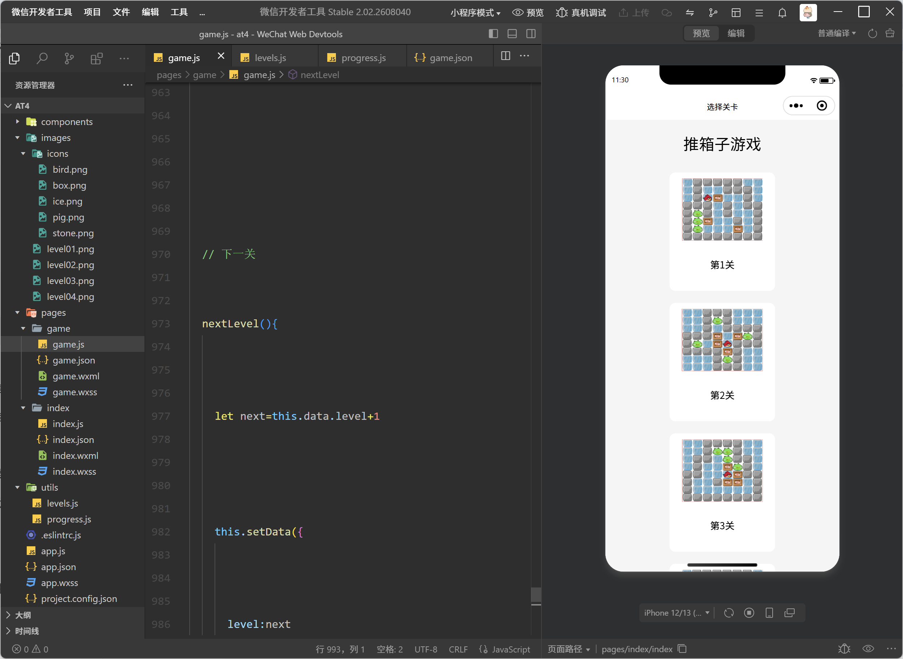
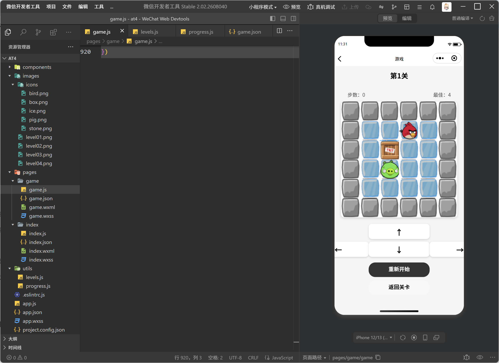
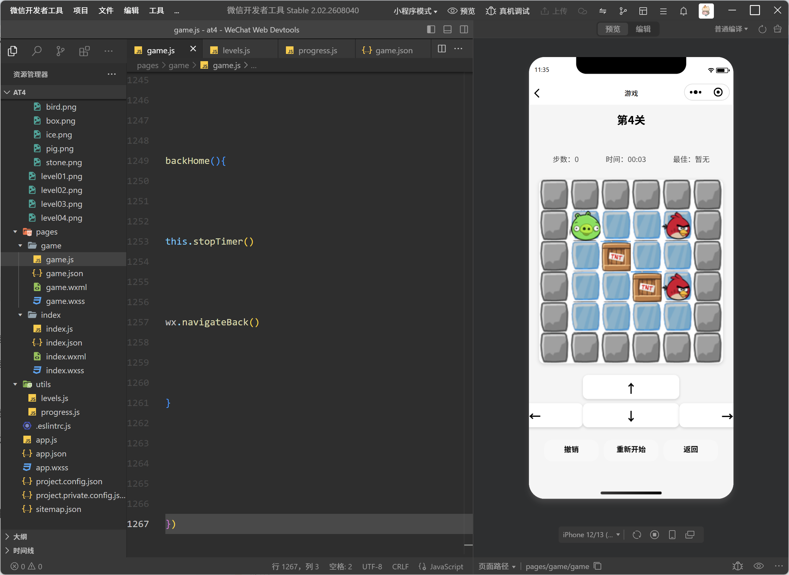
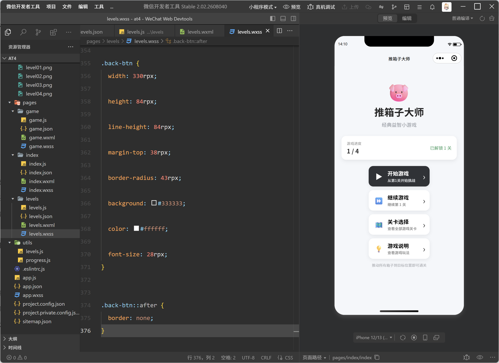
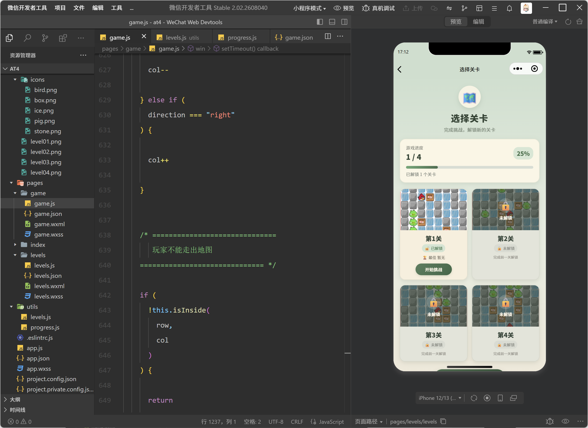
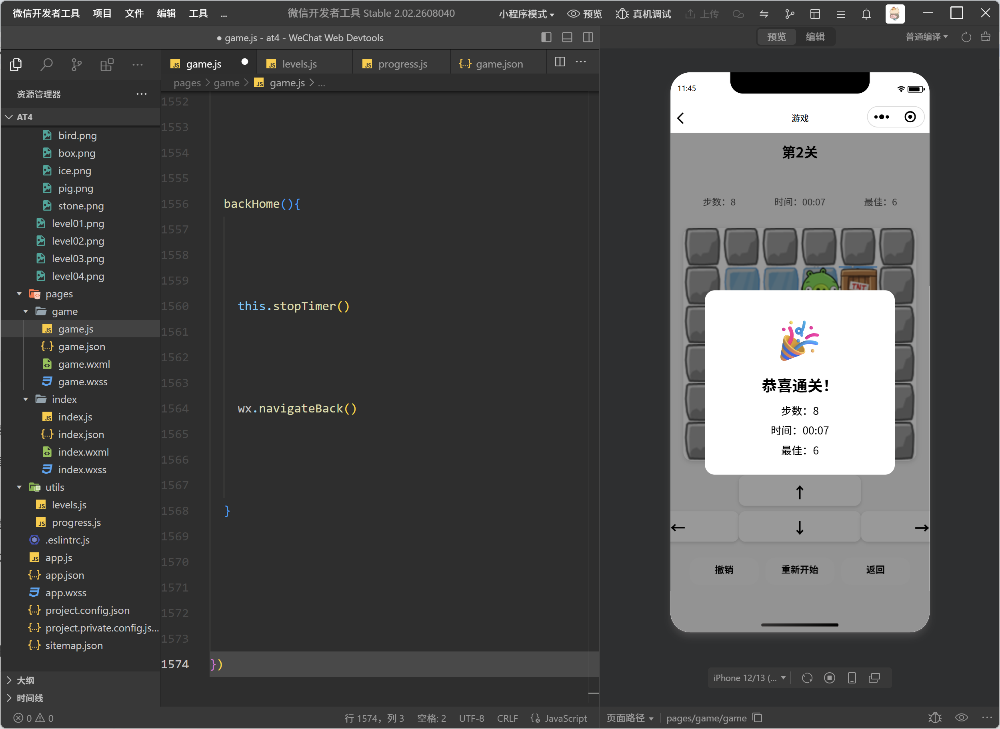
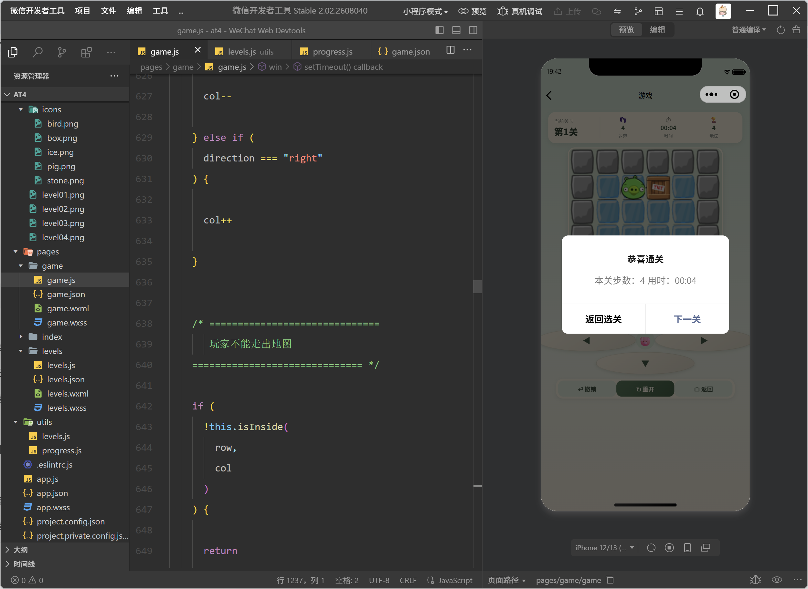

<center>姓名：石晗婷  学号：24020007103

| **姓名和学号**     | 石晗婷，24020007103              |
| ------------------ | -------------------------------- |
| 本实验属于哪门课程 | 中国海洋大学26夏《移动软件开发》 |
| 实验名称           | 实验4：推箱子游戏                |
| 博客地址           |                                  |
| 代码仓库地址       |                                  |

------

# 一、实验内容

### 1、实验基本内容

首先按照实验要求建立基本项目结构：

```
AT4
│
├── images
│   ├── icons
│   │   ├── bird.png
│   │   ├── box.png
│   │   ├── ice.png
│   │   ├── pig.png
│   │   └── stone.png
│   │
│   ├── level01.png
│   ├── level02.png
│   ├── level03.png
│   └── level04.png
│
├── pages
│   ├── index
│   ├── levels
│   └── game
│
├── utils
│   ├── levels.js
│   └── progress.js
│
├── app.js
├── app.json
└── app.wxss
```

其中主要游戏元素分别为：

```
stone.png    墙体
ice.png      地面
box.png      箱子
pig.png      玩家
bird.png     目标位置
```

完成基本游戏后，可以显示推箱子的地图。



------

### 2、使用 Canvas 绘制游戏地图

实验的核心是利用 `<canvas>` 组件显示游戏地图，通过二维数组保存地图信息，再根据不同数字绘制不同的游戏元素。

游戏页面中首先加入 Canvas：

```
<canvas
  canvas-id="gameCanvas"
  class="canvas"
>
</canvas>
```

地图中的不同数字代表不同类型的元素，例如：

```
0：普通地面
1：墙
2：箱子
3：玩家
4：目标位置
```

在 JavaScript 中遍历地图数组，根据当前位置的数据绘制不同图片。

墙体绘制代码如下：

```
if (map[row][col] === 1) {

  ctx.drawImage(
    "/images/icons/stone.png",
    x,
    y,
    cellSize,
    cellSize
  )

} else {

  ctx.drawImage(
    "/images/icons/ice.png",
    x,
    y,
    cellSize,
    cellSize
  )

}
```

之后分别绘制目标位置、箱子以及玩家。

目标位置：

```
this.data.targets.forEach(target => {

  ctx.drawImage(
    "/images/icons/bird.png",
    offsetX + target.col * cellSize,
    offsetY + target.row * cellSize,
    cellSize,
    cellSize
  )

})
```

箱子：

```
this.data.boxes.forEach(box => {

  ctx.drawImage(
    "/images/icons/box.png",
    offsetX + box.col * cellSize,
    offsetY + box.row * cellSize,
    cellSize,
    cellSize
  )

})
```

玩家：

```
ctx.drawImage(
  "/images/icons/pig.png",
  offsetX + this.data.player.col * cellSize,
  offsetY + this.data.player.row * cellSize,
  cellSize,
  cellSize
)
```

最终完成整个游戏地图的绘制。



------

### 3、实现人物移动和推箱子功能



首先为上下左右四个方向分别建立事件：

```
up() {
  this.move("up")
},

down() {
  this.move("down")
},

left() {
  this.move("left")
},

right() {
  this.move("right")
}
```

之后统一调用：

```
move(direction)
```

进行处理。

例如向上移动时：

```
if (direction === "up") {
  row--
}
```

向下移动：

```
else if (direction === "down") {
  row++
}
```

同时还需要判断玩家是否碰到墙体：

```
if (this.data.map[row][col] === 1) {
  return
}
```

如果人物前方存在箱子，则继续判断箱子后方是否可以移动。

```
const boxIndex = this.findBox(row, col)
```

如果后方为墙体或者另一个箱子，则本次推动无效。

```
if (this.data.map[newBoxRow][newBoxCol] === 1) {
  return
}

if (this.findBox(newBoxRow, newBoxCol) !== -1) {
  return
}
```

通过这种方式实现了基本的推箱子规则。

------

# 二、改进

### 1、增加独立首页

原始实验主要以游戏功能为主，为了使整个小程序更加完整，我新增了一个游戏首页。

首页包括：

```
开始游戏

继续游戏

关卡选择

游戏说明
```

效果如下：



首页主要结构代码如下：

```
<button
  class="menu-btn primary"
  bindtap="startGame"
>
  <view class="btn-icon">▶</view>

  <view class="btn-content">
    <view class="btn-title">
      开始游戏
    </view>

    <view class="btn-desc">
      从第1关开始挑战
    </view>
  </view>
</button>
```

关卡选择按钮：

```
<button
  class="menu-btn"
  bindtap="chooseLevel"
>
  <view class="btn-icon">
    🗺️
  </view>

  <view class="btn-content">
    <view class="btn-title">
      关卡选择
    </view>

    <view class="btn-desc">
      查看全部游戏关卡
    </view>
  </view>
</button>
```

点击“关卡选择”后跳转到独立关卡页面：

```
chooseLevel() {

  wx.navigateTo({
    url: "/pages/levels/levels"
  })

}
```

------

## 2、增加关卡选择与关卡解锁

为了使不同关卡之间具有一定的游戏进度关系，我增加了关卡解锁机制。

最初只开放第一关：

```
第1关    已解锁

第2关    未解锁

第3关    未解锁

第4关    未解锁
```

完成第一关以后自动解锁第二关，以此类推。

使用本地缓存保存当前已经解锁到的关卡：

```
wx.setStorageSync(
  "unlockLevel",
  level
)
```

读取解锁进度：

```
function getUnlockLevel() {

  let level =
    wx.getStorageSync("unlockLevel")

  if (!level) {
    level = 0
  }

  return level
}
```

选择尚未解锁的关卡时进行提示：

```
if (index > this.data.unlockLevel) {

  wx.showToast({
    title: "请先完成前面的关卡",
    icon: "none"
  })

  return

}
```

关卡选择页面采用 **2×2 宫格布局**，使四个关卡可以更加直观地显示。

```
.level-grid {
  width: 100%;

  display: grid;

  grid-template-columns:
    repeat(2, 1fr);

  column-gap: 22rpx;

  row-gap: 25rpx;
}
```

效果如下：



------

### 3、完善游戏

在完成基本的推箱子移动、关卡选择和关卡解锁功能以后，为了使游戏过程更加完整，我继续增加了步数统计、游戏计时、最佳成绩、撤销、重新开始、自动进入下一关和继续游戏等功能。



首先增加步数统计功能。每当玩家成功移动一次时，将当前步数加一：

```
this.setData({

  player: {
    row: row,
    col: col
  },

  boxes: newBoxes,

  steps: this.data.steps + 1

})
```

游戏页面会实时显示当前步数：

```
<view class="status-value">
  {{steps}}
</view>

<view class="status-label">
  步数
</view>
```

同时增加游戏计时功能。进入关卡后启动计时器，每秒更新一次时间：

```
this.timer = setInterval(() => {

  this.seconds++

  const minute =
    Math.floor(this.seconds / 60)

  const second =
    this.seconds % 60

  this.setData({

    time:
      this.formatNumber(minute)
      +
      ":"
      +
      this.formatNumber(second)

  })

}, 1000)
```

在玩家通关或退出当前页面后停止计时：

```
stopTimer() {

  if (this.timer) {

    clearInterval(this.timer)

    this.timer = null

  }

}
```

为了增加重复挑战的意义，还使用微信小程序的本地缓存保存每一关的最佳成绩。当本次通关使用的步数少于之前的记录时，更新最佳步数：

```
function saveBest(level, steps) {

  let old = getBest(level)

  if (
    old == null ||
    steps < old
  ) {

    wx.setStorageSync(
      "best_" + level,
      steps
    )

  }

}
```

推箱子过程中如果操作错误，可能会导致箱子进入无法继续移动的位置。因此增加了撤销功能。每次有效移动前，先保存玩家和箱子的当前位置：

```
this.history.push({

  player:
    JSON.parse(
      JSON.stringify(
        this.data.player
      )
    ),

  boxes:
    JSON.parse(
      JSON.stringify(
        this.data.boxes
      )
    )

})
```

点击“撤销”后，读取上一状态并恢复：

```
const last =
  this.history.pop()

this.setData({

  player: last.player,

  boxes: last.boxes,

  steps:
    Math.max(
      this.data.steps - 1,
      0
    )

})
```

如果玩家希望完全重新进行当前关卡，还增加了“重新开始”功能：

```
restartGame() {

  wx.showModal({

    title: "重新开始",

    content:
      "确定重新开始当前关卡吗？",

    success: res => {

      if (res.confirm) {

        this.initGame()

      }

    }

  })

}
```

在通关流程方面，当所有箱子被推到目标位置以后，程序会显示本关的步数和用时，同时自动解锁下一关。玩家可以直接选择进入下一关：

```
nextLevel() {

  const next =
    this.data.level + 1

  this.setData({
    level: next
  })

  this.loadBest()

  this.initGame()

}
```

此外，为了避免每次重新进入小程序都需要从第一关开始，还增加了继续游戏功能。进入某一关时，将当前关卡编号保存到本地：

```
wx.setStorageSync(
  "lastLevel",
  this.data.level
)
```

返回首页后点击“继续游戏”，读取上一次所在的关卡：

```
const lastLevel =
  wx.getStorageSync("lastLevel")
```

然后跳转到对应关卡：

```
wx.navigateTo({

  url:
    "/pages/game/game?level=" +
    this.data.lastLevel

})
```


------

### 4、增加通关自动进入下一关

原始版本通关以后主要显示成功提示，我增加了下一关功能。

首先判断所有目标位置是否已经放置箱子：

```
checkWin() {

  for (
    let i = 0;
    i < this.data.targets.length;
    i++
  ) {

    const target =
      this.data.targets[i]

    let hasBox = false

    for (
      let j = 0;
      j < this.data.boxes.length;
      j++
    ) {

      const box =
        this.data.boxes[j]

      if (
        box.row === target.row &&
        box.col === target.col
      ) {

        hasBox = true
        break
      }

    }

    if (!hasBox) {
      return false
    }

  }

  return true
}
```

通关以后提示：

```
恭喜通关

本关步数：18
用时：00:35

下一关
```

点击下一关：

```
nextLevel() {

  const next =
    this.data.level + 1

  this.setData({
    level: next
  })

  this.loadBest()

  this.initGame()

}
```





# 三、问题总结与体会

### 问题1：Canvas 在不同设备中的大小不合适

最初直接使用固定的格子尺寸绘制游戏地图，例如：

```
let size = 80
```

这样在电脑模拟器中可以正常显示，但在不同大小的手机中容易出现地图太大或者超出区域的问题。

### 解决方法

根据当前设备屏幕宽度动态计算 Canvas 大小：

```
const canvasWidth =
  wx.getWindowInfo()
    .windowWidth * 0.72
```

之后再根据地图大小计算每个格子的尺寸：

```
const cellSize = Math.min(
  canvasWidth / cols,
  canvasWidth / rows
)
```

从而使游戏页面能够更加适合手机显示。

------

### 问题2：关卡页面最初一直纵向排列

设计关卡选择页面时，希望四个关卡以：

```
第1关    第2关

第3关    第4关
```

的形式显示，但最初页面仍然采用纵向排列。

经过检查发现，一方面存在旧样式影响，另一方面当时运行的实际上还是：

```
/pages/index/index
```

页面，而不是新增的：

```
/pages/levels/levels
```

页面。

### 解决方法

将首页和关卡页面完全拆分：

```
pages/index/index
    游戏主页

pages/levels/levels
    关卡选择
```

并使用 Grid 布局：

```
.level-grid {

  display: grid;

  grid-template-columns:
    repeat(2, 1fr);

}
```

最终成功实现了 2×2 关卡排列。

------

### 问题3：WXML 中动态设置进度条宽度时报错

最初直接在 WXML 中写：

```
style="width: {{progressPercent}}%;"
```

开发者工具中出现语法错误。

### 解决方法

改为在 JavaScript 中生成完整样式字符串：

```
const progressStyle =
  "width: " +
  progressPercent +
  "%;"
```

WXML 中只负责读取：

```
style="{{progressStyle}}"
```

从而正常显示关卡进度条。

------

### 问题4：游戏页面内容过长

最初为了显示更多信息，在游戏页面加入了较大的状态卡片、地图、方向键以及功能按钮，导致真机显示时页面高度过长，需要上下滑动才能操作。

### 解决方法

重新规划页面：

```
顶部状态
↓
游戏地图
↓
方向控制
↓
功能按钮
```

并减少各部分间距和控件尺寸，使主要游戏操作尽量能够在手机一屏范围内完成。

------

# 四、收获和体会

通过本次实验，对微信小程序中的 Canvas 绘图有了更加具体的认识。

与前面的普通页面开发相比，推箱子游戏不仅需要考虑 WXML 和 WXSS 页面布局，还需要在 JavaScript 中维护玩家、箱子以及目标位置等游戏状态。尤其是人物移动和推箱子的过程中，需要不断判断墙体、箱子和地图边界之间的关系，使我对程序中的状态判断和逻辑控制有了更加深入的理解。

在原始实验基础上，我还进一步增加了关卡选择、关卡解锁、继续游戏、步数统计、计时、最佳成绩、撤销、重新开始以及通关进入下一关等功能，使原本的基础推箱子案例逐渐完善成一个具有完整游戏流程的小程序。

在页面设计方面，也进一步体会到电脑模拟器与手机真机之间存在明显差别。一个在电脑中显示正常的页面，在手机上可能出现地图过大、按钮位置偏下以及需要滚动等问题，因此需要根据手机屏幕大小动态调整 Canvas 和页面布局。