| **姓名和学号**     |                                                              |
| ------------------ | ------------------------------------------------------------ |
| 本实验属于哪门课程 | 中国海洋大学 26 夏《移动软件开发》                           |
| 实验名称           | 实验 5：鸿蒙开发入门及计算器开发                             |
| 博客地址           | https://blog.csdn.net/2401_89497697/article/details/164472660?spm=1001.2014.3001.5501 |
| 代码仓库地址       |                                                              |


***

# 一、实验内容

### 1、实验基本内容

首先按照实验要求安装 DevEco Studio 并配置 HarmonyOS 开发环境。实验需要用到一台安装有 Windows 10 64 位或 Windows 11 64 位的主机，内存为 16GB 及以上，硬盘为 100GB 及以上。

安装完成后创建 Empty Ability 工程，工程结构如下：


```
MyApplication

│

├── entry

│   ├── src

│   │   ├── main

│   │   │   ├── ets

│   │   │   │   ├── entryability

│   │   │   │   │   └── EntryAbility.ets

│   │   │   │   └── pages

│   │   │   │       └── Index.ets

│   │   │   ├── resources

│   │   │   │   ├── base

│   │   │   │   │   ├── element

│   │   │   │   │   └── media

│   │   │   │   └── rawfile

│   │   │   └── module.json5

│   │   ├── oh-package.json5

│   │   └── build-profile.json5

│   ├── oh-package.json5

│   └── build-profile.json5

│

├── hvigor

├── oh-package.json5

├── build-profile.json5

├── hvigorfile.ts

└── local.properties
```

其中主要业务代码集中在 `entry/src/main/ets/pages/Index.ets`，使用 ArkTS 声明式语法开发。

完成环境搭建后，通过运行 Hello World 工程验证开发环境是否正确，确认应用可以正常编译并在模拟器中运行。


***

### 2、使用 ArkTS 声明式 UI 构建计算器界面

实验的核心是利用 ArkTS 的声明式 UI 组件构建计算器界面，通过 `@State` 状态变量管理输入与结果，再根据不同状态刷新界面。

页面中首先使用 `@Entry` 和 `@Component` 装饰器定义组件：


```
@Entry

@Component

struct Index {

\&#x20; @State display: string = '0'

\&#x20; @State expression: string = ''

\&#x20; @State justEvaluated: boolean = false

\&#x20; @State isError: boolean = false

\&#x20; @State angleMode: string = 'DEG'

\&#x20; @State isDarkMode: boolean = true

\&#x20; // ...

}
```

界面布局采用 `Column` + `Row` 嵌套结构，顶部为工具区（历史、f (x)、主题切换、模式切换），中间为显示区域，下方为按键区域。显示区域包括当前角度模式（DEG/RAD）、完整表达式和当前输入 / 结果：


```
Column() {

\&#x20; Text(this.angleMode)

\&#x20;   .fontSize(13)

\&#x20;   .fontColor(this.accentColor)

\&#x20;   .width('100%')

\&#x20;   .textAlign(TextAlign.End)

\&#x20; Text(this.expression === '' ? ' ' : this.expression)

\&#x20;   .fontSize(18)

\&#x20;   .fontColor(this.subTextColor)

\&#x20;   .width('100%')

\&#x20;   .textAlign(TextAlign.End)

\&#x20; Scroll(this.displayScroller) {

\&#x20;   Text(this.formatDisplay(this.display))

\&#x20;     .fontSize(this.getDisplayFontSize())

\&#x20;     .fontColor(this.isError ? '#FF6B6B' : this.textColor)

\&#x20; }

\&#x20; .scrollable(ScrollDirection.Horizontal)

\&#x20; .scrollBar(BarState.Off)

\&#x20; .align(Alignment.End)

}
```

按键区域使用 `ForEach` 循环渲染按钮行，每个按钮通过 `onClick` 事件触发对应操作，并使用 `stateStyles` 实现瞬时按压反馈：


```
Text(this.getBaseLabel(key))

\&#x20; .fontSize(28)

\&#x20; .fontColor(this.getBaseTextColor(key))

\&#x20; .backgroundColor(this.getBaseBgColor(key))

\&#x20; .borderRadius(40)

\&#x20; .stateStyles({

\&#x20;   normal: { .opacity(1) },

\&#x20;   pressed: { .opacity(0.6) }

\&#x20; })

\&#x20; .onClick(() => { this.onKey(key) })
```

最终完成整个计算器界面的绘制。


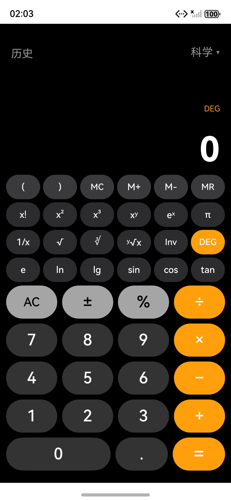


***

### 3、实现数字输入和四则运算功能

首先为数字键、运算符、等号、清空等按键建立统一的事件入口 `onKey`：


```
private onKey(key: string) {

\&#x20; if (key === '') return

\&#x20; if (this.digits.includes(key)) {

\&#x20;   this.inputDigit(key)

\&#x20; } else if (key === '.') {

\&#x20;   this.inputDot()

\&#x20; } else if (key === 'AC') {

\&#x20;   this.clearAll()

\&#x20; } else if (this.ops.includes(key)) {

\&#x20;   this.appendOperator(key)

\&#x20; } else if (key === '=') {

\&#x20;   this.evaluate()

\&#x20; }

}
```

数字输入时，判断当前是否为初始状态 0，如果是则替换，否则追加。最大支持 30 位数字输入：


```
private inputDigit(d: string) {

\&#x20; if (this.isError) this.resetState()

\&#x20; if (this.justEvaluated) {

\&#x20;   this.expression = ''

\&#x20;   this.display = d

\&#x20;   this.justEvaluated = false

\&#x20;   return

\&#x20; }

\&#x20; if (this.display === '0' || this.display === '') {

\&#x20;   this.display = d

\&#x20; } else if (this.display.replace('.', '').replace('-', '').length < 30) {

\&#x20;   this.display += d

\&#x20; }

}
```

运算符输入时，将当前数字追加到表达式中，并记录运算符：


```
private appendOperator(op: string) {

\&#x20; if (this.isError) return

\&#x20; if (this.justEvaluated) {

\&#x20;   this.expression = this.display

\&#x20;   this.justEvaluated = false

\&#x20; } else if (this.display !== '' && this.display !== '-') {

\&#x20;   this.expression += this.display

\&#x20; }

\&#x20; this.display = ''

\&#x20; if (this.expression.length > 0 &&

\&#x20;     this.ops.includes(this.expression.charAt(this.expression.length - 1))) {

\&#x20;   this.expression = this.expression.substring(0, this.expression.length - 1)

\&#x20; }

\&#x20; this.expression += op

}
```

等号触发时，拼接完整表达式并调用递归下降求值器进行计算：


```
private evaluate() {

\&#x20; if (this.isError) return

\&#x20; if (this.justEvaluated) return

\&#x20; let fullExpr = this.expression

\&#x20; if (this.display !== '' && this.display !== '-') {

\&#x20;   fullExpr += this.display

\&#x20; }

\&#x20; // 补全未闭合的括号，去掉末尾多余运算符

\&#x20; const result = this.evalExpression(fullExpr)

\&#x20; this.expression = fullExpr

\&#x20; this.display = this.fmt(result)

\&#x20; this.justEvaluated = true

}
```

通过递归下降求值器处理运算符优先级和括号，实现了基本的四则运算规则。求值器支持 `+`、`−`、`×`、`÷`、`^`（右结合）、括号、一元负号，以及科学计数法数字（如 `4E20`）。


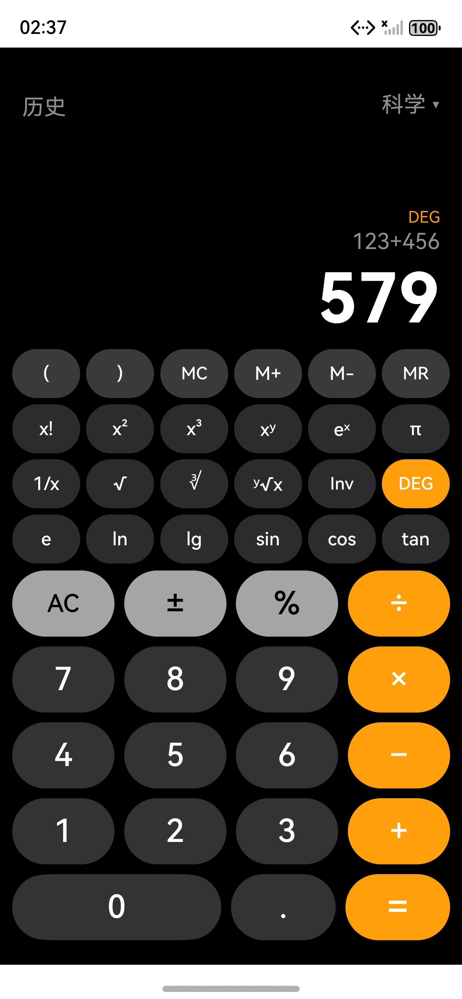


***

# 二、改进

### 1、增加科学计算器功能

原始实验主要以基础四则运算为主，为了使计算器功能更加完整，我新增了科学计算功能。

科学函数包括：


```
sin    正弦

cos    余弦

tan    正切

ln     自然对数

lg     常用对数（log10）

√      平方根

x²     平方

x³     立方

xʸ     幂运算

1/x    倒数

x!     阶乘

∛      立方根

ʸ√x    y次方根

eˣ     指数函数

π      圆周率

e      自然常数
```

以三角函数为例，需要根据当前角度模式（DEG/RAD）进行转换：


```
private toRad(x: number): number {

\&#x20; if (this.angleMode === 'DEG') return x \\\* Math.PI / 180

\&#x20; return x

}

private applySciFunction(key: string) {

\&#x20; const x = this.evalDisplay()

\&#x20; if (key === 'sin') {

\&#x20;   result = Math.sin(this.toRad(x))

\&#x20; } else if (key === 'cos') {

\&#x20;   result = Math.cos(this.toRad(x))

\&#x20; } else if (key === 'tan') {

\&#x20;   const rad = this.toRad(x)

\&#x20;   if (Math.abs(Math.cos(rad)) < 1e-10) throw new Error('undefined')

\&#x20;   result = Math.tan(rad)

\&#x20; }

\&#x20; // ...

}
```

科学函数支持复合表达式，即当表达式中已有运算符时（如 `6+50`），点击科学函数会将当前操作数包装为函数调用（`6+lg(50)`），然后整体求值，而不是覆盖整个表达式。

π 和 e 作为数学常量以符号形式输入（如 `6π`），内部自动理解为隐式乘法 `6*Math.PI`，求值时由表达式解析器的 `parsePrimary` 识别为常量。

阶乘函数需要处理非负整数限制：


```
private factorial(n: number): number {

\&#x20; if (n < 0 || n !== Math.floor(n) || n > 170) throw new Error('invalid')

\&#x20; if (n === 0 || n === 1) return 1

\&#x20; let r = 1

\&#x20; for (let i = 2; i <= n; i++) r \\\*= i

\&#x20; return r

}
```

立方根使用 `Math.cbrt`，可以正确处理负数；y 次方根对负数的奇次根也做了特殊处理。


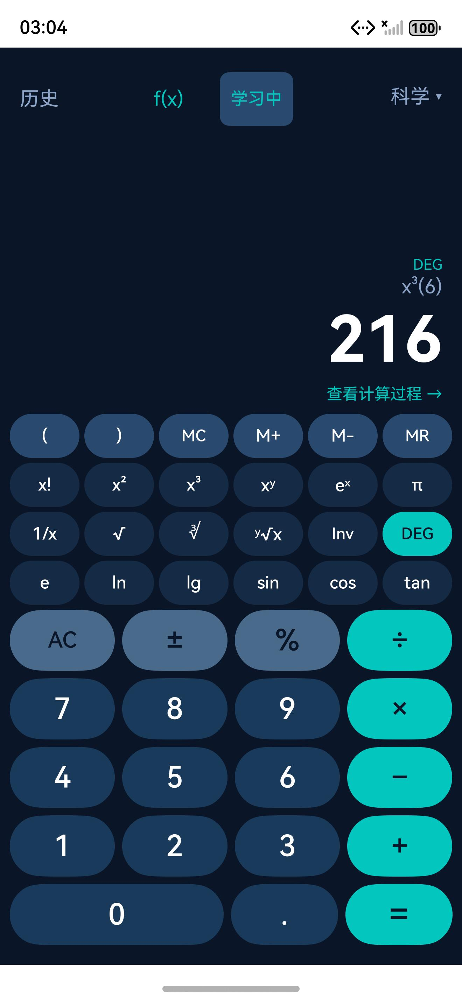


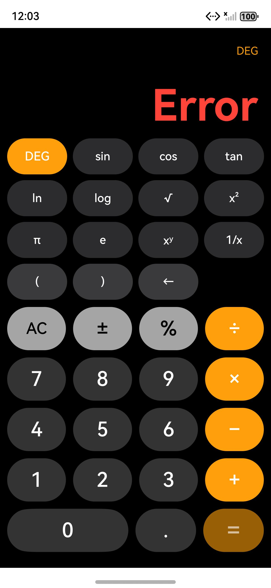


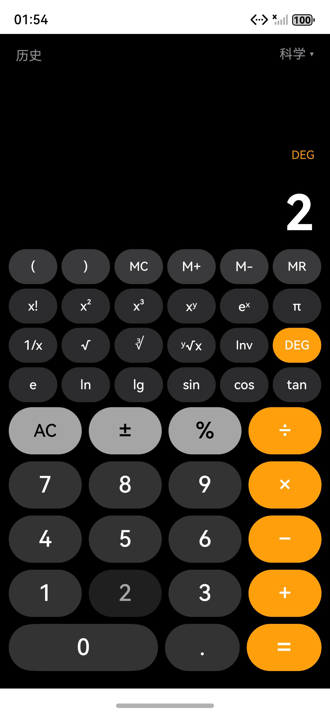


***

### 2、增加 DEG/RAD 角度模式切换与 Inv 反函数

为了使三角函数更加实用，增加了 DEG/RAD 角度模式切换功能。默认使用 DEG 模式，点击 DEG/RAD 按钮可以在两种模式之间切换：


```
private toggleAngleMode() {

\&#x20; this.angleMode = this.angleMode === 'DEG' ? 'RAD' : 'DEG'

}
```

界面中以青蓝高亮显示当前模式，确保用户清楚当前所处的角度单位。

同时增加了 Inv 反函数模式。Inv 激活时，相关按钮文字动态切换为反函数形式：


```
sin  →  asin

cos  →  acos

tan  →  atan

ln   →  eˣ

lg   →  10ˣ
```

实现方式是通过 `invMode` 状态变量和 `getSciLabel` 方法动态返回按钮文字。反三角函数有定义域检测（如 `asin(2)` 报错）。


***

### 3、增加 Memory 存储器功能

为了方便复杂计算过程中的中间结果暂存，增加了 Memory 存储器功能，包括四个操作：


```
MC    清空存储器

M+    当前结果加入存储器

M−    当前结果从存储器中减去

MR    读取存储器中的值
```

实现方式是使用一个私有变量 `memoryValue` 保存存储值，提供 `memoryClear`、`memoryAdd`、`memorySub`、`memoryRecall` 四个方法。测试验证：10 → M+，5 → M+，MR → 15，功能正常。


***

### 4、增加历史记录与持久化

为了方便用户回顾之前的计算过程，增加了历史记录功能。每次有效计算完成后，将表达式和结果保存到历史记录中：


```
interface HistoryRecord {

\&#x20; expression: string

\&#x20; result: string

\&#x20; timestamp: number

}

private addHistory(expr: string, result: string) {

\&#x20; const rec: HistoryRecord = {

\&#x20;   expression: expr,

\&#x20;   result: result,

\&#x20;   timestamp: Date.now()

\&#x20; }

\&#x20; this.history.unshift(rec)

\&#x20; if (this.history.length > 20) {

\&#x20;   this.history = this.history.slice(0, 20)

\&#x20; }

\&#x20; this.saveHistory()

}
```

历史记录最多保存 20 条，最新的记录显示在最上面，超过 20 条时自动删除最旧的一条。单值按 `=`（如 `2 =`）不写入历史记录，只有真正的运算才记录。

历史记录使用 HarmonyOS 官方的 `@ohos.data.preferences` 进行持久化存储，应用关闭后重新打开仍然可以保留历史记录：


```
import preferences from '@ohos.data.preferences'

aboutToAppear() {

\&#x20; preferences.getPreferences(getContext(this), 'calc\\\_prefs').then((prefs) => {

\&#x20;   this.prefs = prefs

\&#x20;   prefs.get('history', '\\\[]').then((val) => {

\&#x20;     const arr = JSON.parse(val as string) as HistoryRecord\\\[]

\&#x20;     if (Array.isArray(arr)) {

\&#x20;       this.history = arr.slice(0, 20)

\&#x20;     }

\&#x20;   })

\&#x20; })

}
```

历史记录面板采用 Stack 覆盖层实现，点击顶部 "历史" 按钮后从底部弹出半屏面板，面板内使用 Scroll + Column 列表展示所有记录。点击某条历史记录可以将结果重新带回计算器继续使用，面板还提供 "清空" 和 "关闭" 按钮。


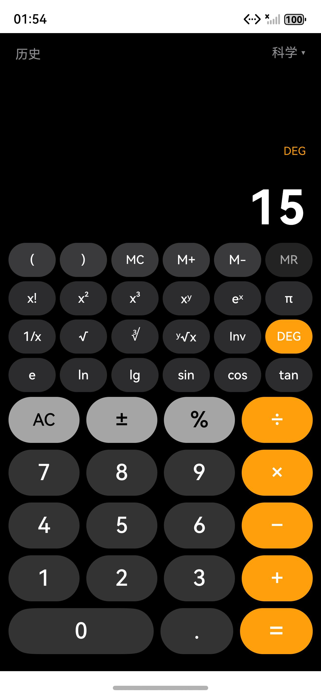


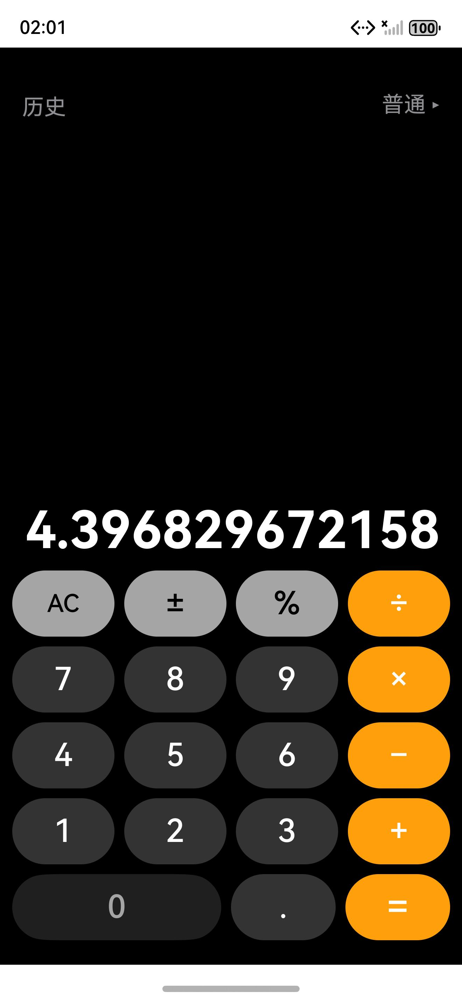


***

### 5、增加普通 / 科学模式切换

为了兼顾简洁性和功能性，增加了普通计算器和科学计算器两种模式的切换功能。点击右上角模式按钮可以在两种模式之间切换：


```
private toggleCalcMode() {

\&#x20; this.calcMode = this.calcMode === 'scientific' ? 'simple' : 'scientific'

}
```

普通模式下隐藏科学键区域，只保留基础数字键盘和运算符，界面更加简洁；科学模式下显示完整的 4 行 × 6 列科学键区域。


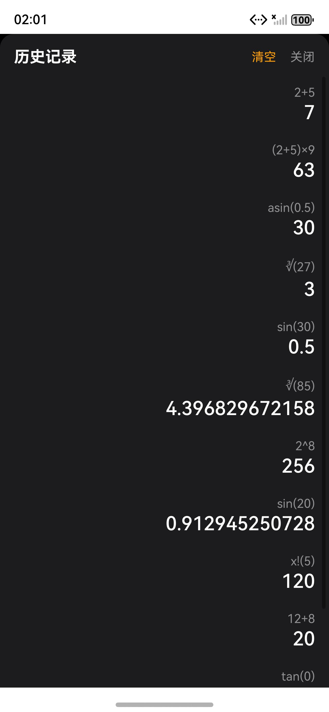


***

### 6、计算过程解析

这是本项目的核心创新功能之一。每次完成计算后，除了显示最终结果，还生成一份 `calculationSteps` 步骤数组。用户点击结果下方的「查看计算过程 →」按钮后，弹出底部面板，从上到下展示本次计算的完整推导步骤。

支持的运算类型及步骤示例：


```
阶乘 5!:

\&#x20; 5! = 5 × 4 × 3 × 2 × 1 = 120

平方 8²:

\&#x20; 8² = 8 × 8 = 64

立方 3³:

\&#x20; 3³ = 3 × 3 × 3 = 27

三角函数 sin(30°) DEG模式:

\&#x20; 角度模式：DEG

\&#x20; 30° × π / 180 = π / 6

\&#x20; sin(π / 6) = 0.5

对数 lg(100):

\&#x20; lg(100) = log10(100) = 2

平方根 √144:

\&#x20; √144 = 12，因为 12 × 12 = 144
```

实现方式是新增 `generateSteps(expr, result, funcType, funcArg)` 方法，根据 `funcType` 参数生成对应的步骤字符串数组，存入 `@State calcSteps: string[]`，面板使用 `Scroll` + `ForEach` 渲染。只有真正存在可解释的完整计算时才显示「查看计算过程」按钮，初始状态、正在输入、Error、单纯单值按 = 时均不显示。


***

### 7、函数曲线可视化（自定义表达式绘图）

在顶部工具栏增加「f (x)」按钮，点击后打开全屏函数绘图页面。绘图页面支持用户自行输入数学表达式并绘制曲线，同时提供 9 个常用预设函数快捷按钮：


```
sin(x)   cos(x)   tan(x)   x²   x³   √x   ln(x)   log(x)   |x|
```

页面结构：顶部为返回按钮和标题，中间为表达式输入框和「绘图」按钮，下方为 Canvas 绘图区，最底部为预设函数快捷按钮网格。

绘图核心功能：


* **自定义表达式解析**：用户输入 `x*x`、`sin2x`、`|x|`、`2x+1` 等自然数学写法，程序通过 `normalizeExpr()` 预处理器统一转换为标准表达式（`2x`→`2*x`、`sin2x`→`sin(2*x)`、`|x|`→`abs(x)`、`√x`→`sqrt(x)`、`x²`→`x^2`），再交给安全递归下降解析器求值，不使用 `eval()`。

* **坐标系与网格**：绘图区包含 x 轴、y 轴、原点、坐标刻度和网格线，默认范围 x ∈ \[-10, 10]，y ∈ \[-10, 10]。

* **定义域自动处理**：`sqrt(x)` 在 x < 0、`ln(x)`/`log(x)` 在 x ≤ 0 时返回 NaN，不参与绘制。

* **不连续函数断点**：`tan(x)` 等函数在渐近线附近（y 值超出绘图区合理范围）时自动断开 Path，下一个合法点重新 `moveTo`，不会出现贯穿画布的错误连线。

* **解析失败清空**：输入非法表达式时，显示错误提示并清空旧曲线和旧函数标题，不会残留上一张图造成误解。

实现核心是 `drawGraph()` 方法，遍历 x 范围内的采样点，调用 `evaluateAt(normalizedExpr, x)` 计算对应函数值后映射到 Canvas 像素坐标，使用 `canvasCtx.beginPath()` + `moveTo()` + `lineTo()` + `stroke()` 绘制曲线。


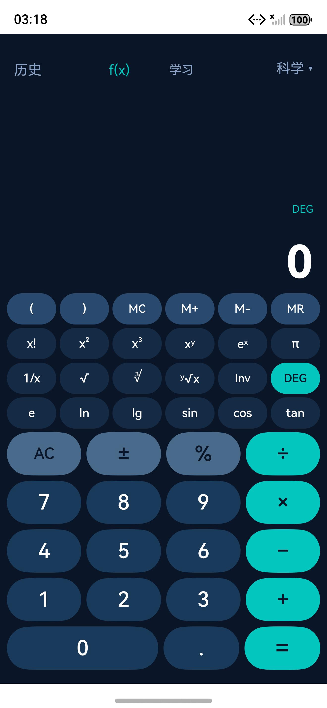


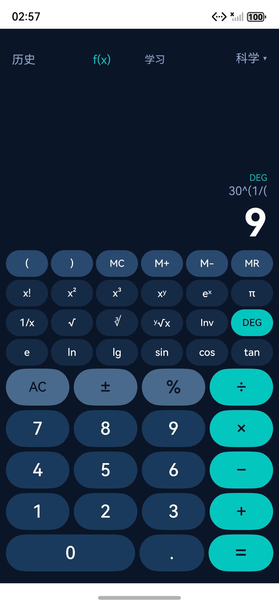


***

### 8、深浅主题切换

将原有的单一深色主题升级为支持深色 / 浅色双主题切换。顶部工具栏增加主题切换按钮（深色显示 ☾，浅色显示 ☀），点击一次切换主题。

深色主题（Ocean 深海蓝）配色：


```
背景色：    #0A1628  深海蓝

卡片色：    #152A45  深蓝灰

数字键：    #1A3A5C  中蓝

科学键：    #152A45  深蓝灰

运算符：    #00C7BE  青蓝（强调色）

功能键：    #2A4A6E  灰蓝

主文字：    #FFFFFF  白色

副文字：    #8BA3C7  浅蓝灰
```

浅色主题配色：


```
背景色：    #F0F2F5  浅灰白

卡片色：    #FFFFFF  白色

数字键：    #FFFFFF  白色

科学键：    #E8ECF1  浅灰蓝

运算符：    #00C7BE  青蓝（强调色）

功能键：    #D8DEE6  灰蓝

主文字：    #1A1A2E  深灰

副文字：    #6B7280  中灰
```

实现方式是将所有颜色定义为 `@State` 变量，切换主题时调用 `applyTheme()` 方法批量更新所有颜色值，触发 ArkUI 响应式刷新。主题状态使用 `@ohos.data.preferences` 持久化保存（key 为 `themeMode`），应用重启后自动恢复上次选择的主题。

主题切换属于纯 UI 状态，不影响任何计算状态（表达式、结果、DEG/RAD、历史记录等均保持不变）。主题覆盖计算器主页、历史记录面板、计算过程面板和函数绘图页面。


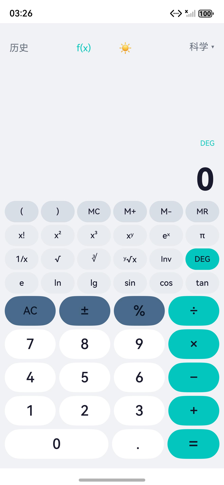


***

### 9、大数字输入与科学计数法自适应显示

为了支持大数运算，对输入显示和结果显示进行了分层处理：


* **输入阶段**：原始输入作为字符串保存，最大支持 30 位数字（小数点和负号不计入）。显示层使用 `formatDisplay()` 加入千位分隔符（如 `20,000,000,000,000,000,000`），内部表达式仍保存不带逗号的原始字符串。长数字使用水平 Scroll 容器，自动保持末尾可见，用户可横向滑动查看。

* **结果阶段**：当计算结果的绝对值 ≥ 1e15 或 < 1e-9 时，自动切换为科学计数法显示，并清理格式（`2.000000e+73` → `2E73`，去掉尾 0、小数点和 + 号）。普通结果仍正常显示并加千位分隔。

* **科学计数法连续运算**：表达式解析器的 `parseNumber` 支持识别 `E/e` 科学计数法数字（如 `4E20`、`1.5e-10`），因此科学计数法结果可以继续参与四则运算和科学函数运算（如 `4E20 × 52 = 2.08E22`）。

* **浮点误差处理**：`fmt()` 函数使用 `Math.round(n * 1e12) / 1e12` 去除浮点尾差（如 `sin(30°)` 显示 `0.5` 而非 `0.49999999999999994`），`-0` 统一显示为 `0`。


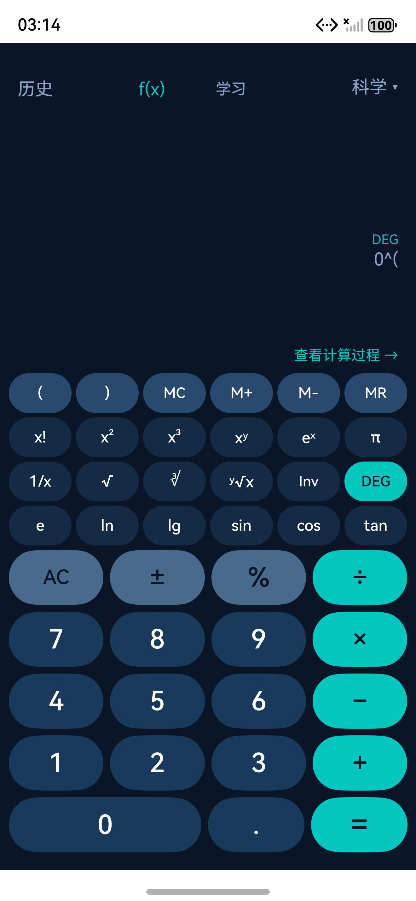


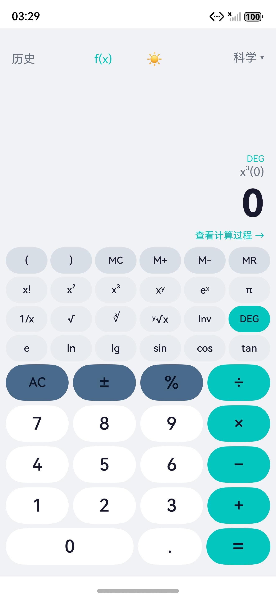


***

# 三、问题总结与体会

### 问题 1：Project sync failed / Build Init failed

最初创建工程后，DevEco Studio 顶部一直显示 `Project sync failed`，Build 面板显示 `Ohpm Install successful` 但 `Build Init failed`，hvigor 输出 `BUILD FAILED`。

向上查看完整错误日志，第一条有效错误不是最后一句 `BUILD FAILED`，而是：


```
00303149 Configuration Error: Path not found. At file: d:\Users\\\\...\MyApplication\entry
```

### 解决方法

经过排查，根因是全局最近工程记录 `recentProjects.xml` 中的工程路径盘符为小写 `d:/...`，而 hvigor 内部使用 `fs.realpathSync.native(t) === t` 做严格相等校验，真实路径盘符为大写 `D:\...`，两者不相等即判定路径不存在。工程自身的 `build-profile.json5`、`oh-package.json5` 等配置均正常。

修复方式：关闭 DevEco Studio 后，将 `recentProjects.xml` 中的 `d:/Users` 改为 `D:/Users`（原文件备份为 .bak），再重启 IDE。随后 Build Init successful，命令行构建输出 `BUILD SUCCESSFUL`。


***

### 问题 2：输入单数字后按 = 显示 Error

测试中发现，输入 `2` 后直接按 `=`，结果显示 `Error` 而不是保持 `2`。正确行为应该是：一个合法的单独数字本身就是一个合法表达式，`2 =` 应该得到 `2`。同样，科学函数计算后（如 `sin(30)=0.5`）再按 `=` 也会变成 Error。

### 解决方法

检查 `evaluate` 方法和 `applySciFunction` 方法，发现科学函数计算成功后 `justEvaluated` 被错误地设为 `false`，导致再按 `=` 时 `evaluate` 把 expression 和 display 拼接成非法表达式。修复为所有计算完成路径统一设置 `justEvaluated = true`，同时在 `evaluate` 开头增加 `justEvaluated` 检查 —— 已完成计算后再按 `=` 直接保持结果，不重新解析。

修复后实测：`2 = → 2`、`sin(30) = 0.5 → 再按 = → 0.5`、`2+3=5 → 再按 = → 5` 均正确。


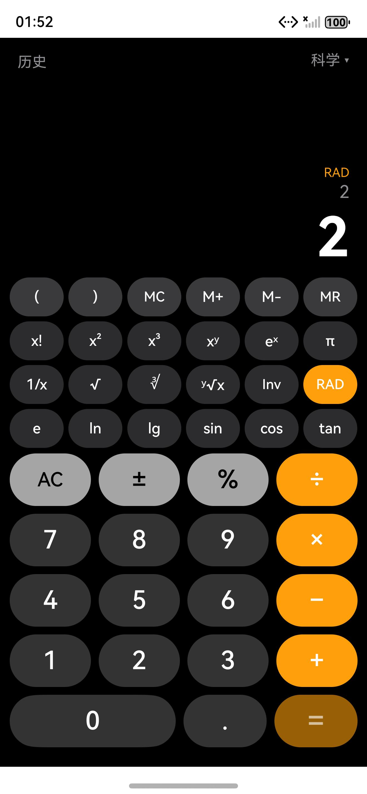


***

### 问题 3：计算完成后按运算符导致表达式重复

修复 `2 = → Error` 后，进一步测试发现：`2 + 3 = 5` 后按 `+`，表达式变成 `55+` 而不是 `5+`，再输入 `4 =` 得到错误结果。同时，计算完成后直接输入数字会追加到结果后面（`5` 后按 `7` 变成 `57`），而正确行为应该是开始新计算。

### 解决方法

检查 `appendOperator` 方法，发现 `justEvaluated` 时先执行了 `this.expression = this.display`（设为 "5"），然后紧接着又执行了 `this.expression += this.display`（追加为 "55"），导致表达式重复追加。修复为 `if-else if` 结构。

同时统一了计算完成后的完整状态行为：


| 操作             | = 之后行为             |
| ---------------- | ---------------------- |
| 数字键 0\~9      | 覆盖旧结果，开始新计算 |
| 小数点 .         | 显示 `0.`，开始新小数  |
| 运算符 + − × ÷ ^ | 使用旧结果继续计算     |
| 一元科学函数     | 直接对当前结果求值     |
| ±                | 对当前结果取反         |
| Error 后输入数字 | 清除 Error，开始新输入 |


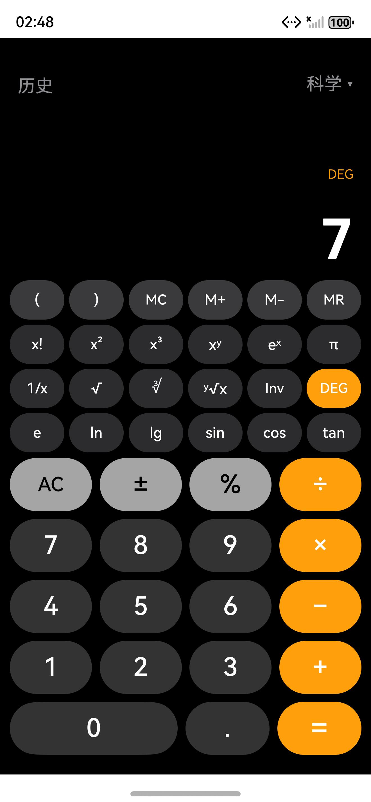


***

### 问题 4：科学函数无法参与复合表达式

测试中发现，`6 + 50` 后点击 `lg`，原来的 `applySciFunction` 直接覆盖整个 expression，变成只有 `lg(50)`，丢失了前面的 `6+`。同样，`2×30` 后点击 `sin` 也无法得到 `2×sin(30)=1`。

### 解决方法

修改 `applySciFunction` 方法：当 `expression !== ''` 且非 `justEvaluated` 时，科学函数只包装当前操作数（将 `display` 替换为函数调用形式），拼接到 expression 后，将 display 清空，然后调用 `evaluate()` 整体求值。独立计算（expression 为空）时保持原行为。

同时在主计算器表达式解析器的 `parsePrimary` 中增加了 8 个科学函数 Token（sin/cos/tan/ln/lg/sqrt/cbrt/abs），使复合表达式如 `6+lg(50)`、`2×sin(30)` 能被正确解析求值。

修复后实测：`6+50 → lg → = → 7.69897`、`2×30 → sin → 1`、`5+9 → √ → 8` 均正确。


***

### 问题 5：按钮按压状态卡住不恢复

界面开发完成后，发现点击任意数字或功能按钮后，该按钮会保持变暗状态，必须再点击另一个按钮才恢复。这是因为代码中使用了 `@State pressedKey` 长期保存按压状态，`onClick` 中设置后一直保留直到下一次点击。

### 解决方法

删除 `pressedKey` 状态变量和所有相关引用，改用 ArkUI 自带的 `stateStyles` 机制实现瞬时按压反馈：


```
.stateStyles({

\&#x20; normal: { .opacity(1) },

\&#x20; pressed: { .opacity(0.6) }

})
```

按压状态只在手指按住期间存在，松开后立即恢复。DEG/RAD 和 Inv 作为真正的模式状态仍然持续高亮，与按压状态分开管理。


***

### 问题 6：深浅主题切换不生效

实现深浅主题切换时，最初将颜色定义为普通 getter 方法（根据 `isDarkMode` 返回不同值），但切换主题后界面颜色没有变化。

### 解决方法

ArkUI 的响应式更新依赖 `@State` 变量的引用变化，普通 getter 不会被追踪。将所有颜色改为 `@State` 变量，切换主题时调用 `applyTheme()` 方法批量更新所有颜色值，触发响应式刷新。


***

# 四、收获和体会

通过本次实验，对 HarmonyOS 应用开发和 ArkTS 声明式 UI 有了更加具体的认识。

与前面的微信小程序开发相比，鸿蒙开发不仅需要理解声明式 UI 的布局方式（Column/Row/Stack/ForEach/Scroll/Canvas），还需要在 ArkTS 中维护严格的类型系统（不能使用 any，需要显式类型标注），以及掌握 DevEco Studio 的工程配置和构建流程。尤其是计算器的运算逻辑中，需要不断处理状态流转（输入中、计算完成、Error 状态）、表达式拼接、运算符优先级和括号解析、科学函数复合表达式、π/e 常量与隐式乘法，使我对程序中的状态机设计和递归下降解析器的实现有了更加深入的理解。

在原始实验基础上，我还进一步增加了科学函数（sin/cos/tan/ln/lg/√/x²/x³/xʸ/1/x/x!/∛/ʸ√x/eˣ/π/e）、DEG/RAD 角度模式切换、Inv 反函数、Memory 存储器、20 条历史记录与 Preferences 持久化、普通 / 科学模式切换、计算过程解析、自定义表达式函数绘图、深浅双主题切换、大数字输入与科学计数法自适应显示等功能，使原本的基础计算器案例逐渐完善成一个兼具计算功能、学习辅助、函数可视化和视觉特色的完整应用。

在开发过程中也遇到了多个实际问题，包括工程同步失败（盘符大小写问题）、单数字按等号报错、运算符表达式重复追加、科学函数无法参与复合表达式、按钮按压状态卡住、深浅主题切换不生效等。通过查看完整错误日志、逐行排查代码逻辑、在模拟器中实际点击测试，最终逐一解决了这些问题。这个过程让我深刻体会到：不能只看最后一句 `BUILD FAILED`，要向上找到第一条有效错误；不能只看代码逻辑是否 "看起来对"，要在真实环境中实际操作验证；状态流转的边界条件（如计算完成后按数字 vs 按运算符、科学函数独立计算 vs 复合表达式）需要逐一测试，不能凭直觉假设；ArkUI 的响应式更新依赖 `@State` 变量的引用变化，普通 getter 和直接修改数组内部对象字段都不会触发刷新。

在页面设计方面，也进一步体会到了模拟器与真实设备之间存在差别。一个在代码中看起来合理的按钮位置，在模拟器中可能因为靠近状态栏而无法点击；一个固定大小的字体在不同屏幕尺寸下可能显示异常；科学按钮数量较多时需要合理控制按钮高度和间距，确保整个计算器在一屏内可用。因此需要根据实际运行效果动态调整布局参数，确保应用在目标设备上有良好的用户体验。