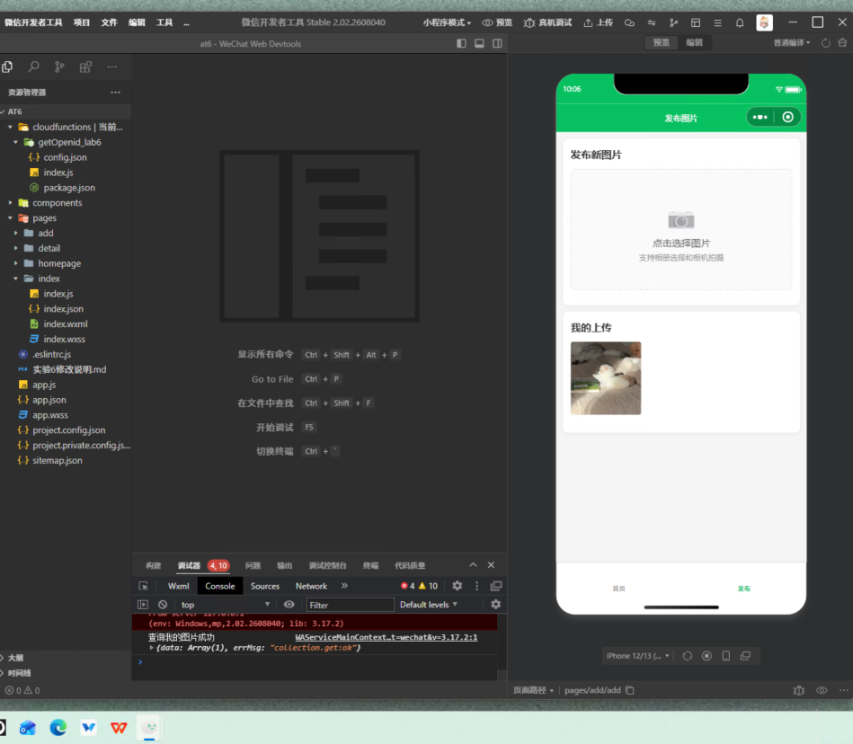
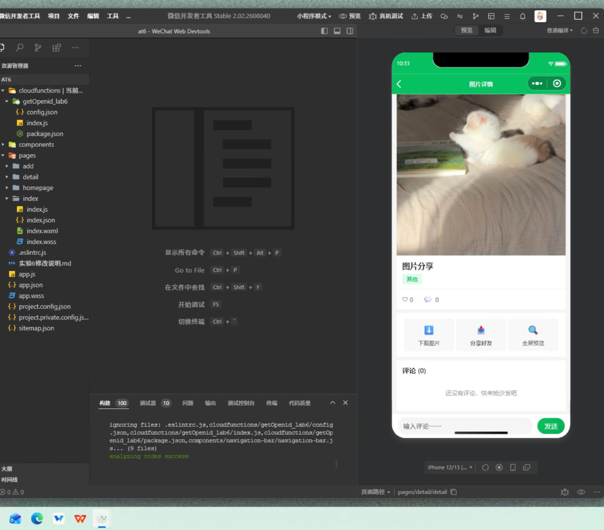
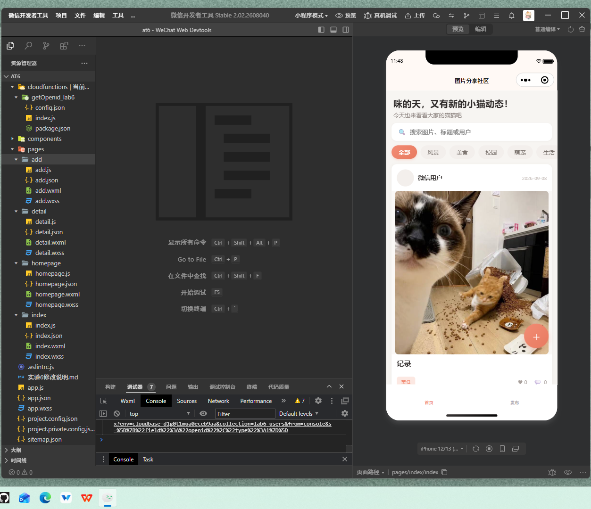
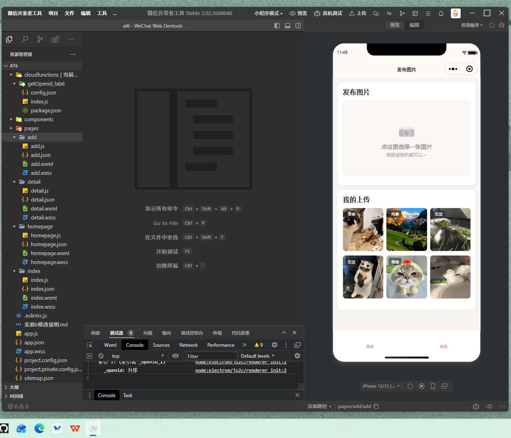
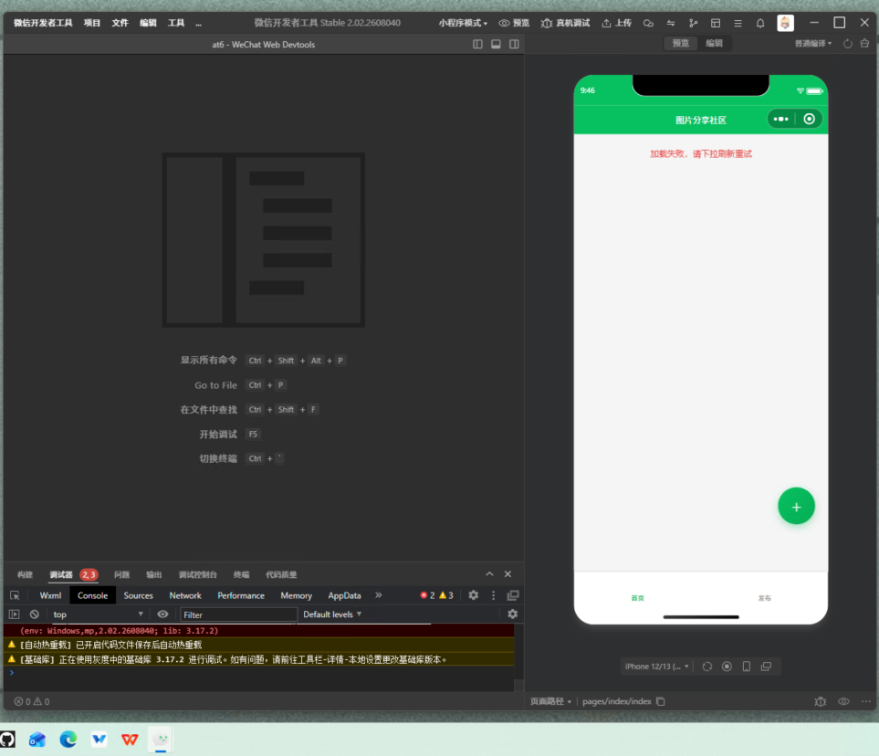

<center>姓名：石晗婷  学号：24020007103</center>

| 姓名和学号         | 石晗婷，24020007103                                          |
| ------------------ | ------------------------------------------------------------ |
| 本实验属于哪门课程 | 中国海洋大学26夏《移动软件开发》                             |
| 实验名称           | 实验6：基于微信小程序云开发的图片分享社区                    |
| 博客地址           | [移动软件开发-CSDN博客](https://blog.csdn.net/2401_89497697/article/details/164740120?spm=1011.2124.3001.6209) |
| 代码仓库地址       | [GitHub仓库](https://github.com/ATmixiu/mobile-software-lab) |

## 一、实验内容

### 1、实验流程

本实验旨在开发一个基于微信小程序云开发的图片分享社区，涉及云数据库、云存储、云函数三大云开发能力的综合应用。

首先进行项目初始化，在微信开发者工具中创建小程序项目，配置AppID和云开发环境。在app.js中初始化云开发环境：

```javascript
wx.cloud.init({
  env: 'cloudbase-d1g0t1mua0eceb9aa',
  traceUser: true,
});
```

之后创建实验6专用的云函数`getOpenid_lab6`，用于获取当前用户的唯一标识openid。由于微信小程序的安全限制，前端无法直接获取用户openid，必须通过云函数在服务端获取。云函数使用官方wx-server-sdk，部署时选择"云端安装依赖"：

```javascript
const cloud = require('wx-server-sdk')
cloud.init({ env: cloud.DYNAMIC_CURRENT_ENV })
exports.main = async (event, context) => {
  const wxContext = cloud.getWXContext()
  return {
    openid: wxContext.OPENID,
    appid: wxContext.APPID,
    unionid: wxContext.UNIONID,
  }
}
```

接下来创建4个核心页面：首页（图片列表）、发布页（图片上传）、个人主页（用户图片展示）、详情页（图片详情与操作）。在app.json中注册页面并配置tabBar：

```json
{
  "pages": [
    "pages/index/index",
    "pages/add/add",
    "pages/homepage/homepage",
    "pages/detail/detail"
  ],
  "tabBar": {
    "list": [
      { "pagePath": "pages/index/index", "text": "首页" },
      { "pagePath": "pages/add/add", "text": "发布" }
    ]
  }
}
```

然后实现图片上传功能。在发布页使用`wx.chooseMedia()`选择图片（支持相册和相机），通过`wx.cloud.uploadFile()`上传到云存储独立目录`lab6/photos/`，上传成功后将fileID和用户信息写入云数据库集合`lab6_photos`：

```javascript
wx.cloud.uploadFile({
  cloudPath: `lab6/photos/${timestamp}-${random}.${ext}`,
  filePath: selectedImage,
  success: res => {
    const fileID = res.fileID;
    db.collection('lab6_photos').add({
      data: {
        photoUrl: fileID,
        avatarUrl: userInfo.avatarUrl,
        nickName: userInfo.nickName,
        createTime: db.serverDate()
      }
    });
  }
});
```

首页实现图片列表展示，使用云数据库的`orderBy('createTime', 'desc')`按时间倒序查询，每条记录显示用户头像、昵称、地区、图片、发布日期。点击图片进入详情页，点击用户信息进入个人主页。



详情页实现三大功能：下载图片（`wx.cloud.downloadFile()` + `wx.saveImageToPhotosAlbum()`）、分享给好友（`onShareAppMessage()`，path携带图片_id）、全屏预览（`wx.previewImage()`）。

个人主页根据传入的openid查询该用户的所有图片，顶部展示用户信息，图片按三列网格展示。

基础功能完成后的简单版本效果如下图所示：



### 2、改进

上面只是简单地实现了教材要求的基础功能，后面对项目进行了全面的功能增强和UI优化，将实验从单纯的"图片展示程序"升级为真正具有社区交互能力的图片分享小程序。

#### 2.1 创新功能增强

**（1）图片标题、简介与分类标签**

在发布页增加标题输入（必填，最多30字）、简介输入（可选，最多120字）、分类选择（必选，固定为风景/美食/校园/萌宠/生活/其他），上传成功后写入lab6_photos的title/description/category字段。老数据兼容：旧记录无这些字段时，title默认显示"图片分享"，category默认显示"其他"。

**（2）分类浏览与关键词搜索**

首页顶部增加横向分类栏（全部/风景/美食/校园/萌宠/生活/其他），点击分类后通过数据库where条件筛选，同分类内仍按时间倒序排列。同时增加搜索框，支持根据标题、简介、分类、用户昵称进行关键词搜索，采用客户端过滤方案，加入300ms防抖避免频繁刷新。搜索与分类筛选可共同工作。

**（3）图片点赞系统**

新建独立集合`lab6_likes`，每条记录保存photoId、userOpenid、createTime。一个用户对同一图片只能点赞一次（photoId + userOpenid唯一约束）。点赞数通过count查询实时计算，不使用冗余计数字段避免并发错误。取消点赞时仅删除当前用户自己的点赞记录，禁止删除其他用户点赞。所有点赞操作均有失败回滚机制。

```javascript
// 点赞：添加新记录
db.collection('lab6_likes').add({
  data: {
    photoId: photoId,
    userOpenid: openid,
    createTime: db.serverDate()
  }
});
// 点赞数查询
db.collection('lab6_likes').where({ photoId: photoId }).count()
```

**（4）图片评论系统**

新建独立集合`lab6_comments`，每条评论保存photoId、userOpenid、nickName、avatarUrl、content、createTime。评论按createTime正序排列。评论内容校验：不能为空、去除首尾空格、最长100字。用户只能删除自己的评论，删除前通过wx.showModal二次确认。

**（5）用户主页数据统计**

个人主页顶部增加统计栏，显示作品数（该用户lab6_photos记录数量）、获赞数（该用户所有图片在lab6_likes中获得的点赞总数，通过db.command.in批量查询）、分类数（该用户作品中不同category的数量）。

**（6）分页加载与下拉刷新**

首页图片列表采用分页加载（PAGE_SIZE=10），首次加载limit(10)，上拉触底时通过skip(page * pageSize) + limit(10)加载下一页。使用isLoading和hasMore状态控制，防止重复请求和重复数据。下拉刷新时清空当前数据，page重置为0，重新获取第一页。

**（7）用户个人资料系统**

新建独立集合`lab6_users`，每个用户通过openid唯一对应一份资料。支持用户主动选择头像（`<button open-type="chooseAvatar">`）和填写昵称（`<input type="nickname">`），头像上传到独立云存储目录`lab6/avatars/`。保存时先查询是否已有记录，有则update，没有则add，禁止同一个openid重复创建多条记录。发帖和评论时优先使用lab6_users中的最新资料，没有资料时安全降级为默认头像和"匿名喵友"。不批量修改历史帖子和评论，新发布的内容自动使用最新资料。

创新功能完成后的效果如下图所示：


#### 2.2 UI与交互设计优化

在完成功能开发的基础上，对整体视觉设计进行了全面升级，从微信默认绿色风格转变为暖色奶油主题，配合轻度猫咪主题文案，打造出一个精致、温暖、具有社区氛围的图片分享小程序。

**配色方案**：
- 全局背景：#F7F5F2（暖灰奶油色）
- 卡片背景：#FFFFFF
- 主色：#F28C74（柔和珊瑚橙），用于主要按钮、选中状态、点赞激活
- 辅助浅色：#FCE8E2，用于分类标签背景
- 主文字：#2F2B2A，次级文字：#8A817D

**组件设计**：所有内容采用白色卡片，24rpx圆角，微阴影；分类标签采用胶囊形状；主要操作按钮采用圆角44rpx的胶囊形状，珊瑚橙渐变背景；首页右下角圆形悬浮发布按钮。

**猫咪主题文案**：仅在欢迎语、空状态、加载提示等轻松场景使用轻度猫咪口吻，如"咪的天，又有新的小猫动态！"、"猫猫正在赶来……"、"咪到底啦～"、"咪两句吧……"。正式功能词（图片、发布图片、下载图片、分享图片等）全部保留，保持课程项目的正式感。

UI优化完成后的效果如下图所示：





### 3、增加图标与装饰元素

整体框架完成以后，在一些部分增加图标和装饰元素，通过emoji图标和视觉装饰提升页面的趣味性和辨识度。

首页欢迎区域使用猫咪相关的文案营造社区氛围，搜索框左侧使用🔍图标，空状态使用🐱图标，加载状态使用旋转动画。发布页选择区域使用📷图标，详情页操作按钮使用⬇️（下载）、📤（分享）、🔍（全屏预览）图标，点赞按钮使用♡/♥切换。个人主页地区信息使用📍图标。

图标的位置和样式可以根据整体设计风格灵活调整，关键是保持视觉一致性，避免过度装饰影响内容展示。具体效果如下图所示：

（此处插入各页面图标和装饰元素展示截图）

并且各页面均支持滚动浏览，具有更好的视觉效果和用户体验。首页支持下拉刷新和上拉加载更多，详情页评论区支持滚动查看历史评论，个人主页支持滚动浏览用户所有作品。

## 二、问题总结与体会

描述实验过程中所遇到的问题，以及是如何解决的。有哪些收获和体会，对于课程的安排有哪些建议。

### 问题1：云环境ID误读导致云函数调用失败

**问题描述**：在配置云开发初始化时，误将环境ID写为`cloudbase-0fg01imua0eceb9aa`，导致云函数调用失败，报错[100003] Env Not Exists。

**解决方法**：在云开发控制台顶部环境下拉→"管理我的环境"中查看正确的环境ID为`cloudbase-d1g0t1mua0eceb9aa`，修正app.js中的配置后问题解决。

**代码实现**：
```javascript
wx.cloud.init({
  env: 'cloudbase-d1g0t1mua0eceb9aa',  // 必须从云开发控制台准确复制
  traceUser: true,
});
```

### 问题2：首页增强功能实现后渲染异常

**问题描述**：首页增加搜索和分类筛选功能后，编译通过但首页只显示搜索框，分类栏和图片列表完全不渲染，Console报MiniProgramError。



**问题原因**：index.js中使用了箭头函数（`list.filter(item => {...})`）和`this.searchTimer`（未在data中定义），在某些基础库版本下导致渲染异常。

**解决方法**：
1. 将箭头函数改为普通function函数
2. 在data中显式定义`searchTimer: null`
3. 所有`this.searchTimer`引用改为`this.data.searchTimer`
4. 重新编译后问题解决

### 问题3：新版微信API调整导致用户信息获取失败

**问题描述**：实验教材中使用的`wx.getUserInfo()`和`open-type="getUserInfo"`在新版微信中已调整，无法直接获取用户真实头像昵称，导致页面显示默认用户信息。

**解决方法**：
1. 采用全局缓存+默认值机制，首次进入时从本地存储读取用户信息
2. 如无用户信息，使用默认值（"匿名喵友"）保证小程序正常运行
3. 新增用户个人资料系统，使用`<button open-type="chooseAvatar">`和`<input type="nickname">`支持用户主动选择头像和填写昵称
4. 业务逻辑不受影响，所有功能均可正常使用

### 问题4：点赞并发计数问题

**问题描述**：如果直接在lab6_photos中使用likeCount字段记录点赞数，在高并发场景下可能出现计数错误，且无法精确控制用户点赞状态。

**解决方法**：
1. 新建独立集合lab6_likes记录点赞关系
2. 点赞数通过count查询实时计算，不使用冗余计数字段
3. 一个用户对同一图片只能点赞一次（photoId + userOpenid唯一约束）
4. 取消点赞时仅删除当前用户自己的点赞记录

### 问题5：云资源隔离与保护

**问题描述**：当前AppID的云环境同时有其他程序使用，包含food_records、hotel_records、shared_records、wallet等已有集合，如果操作不当可能误删或修改其他项目的云资源。

**解决方法**：
1. 严格遵守云资源隔离原则，所有实验6资源均使用lab6_前缀
2. 数据库集合：lab6_photos、lab6_likes、lab6_comments、lab6_users
3. 云函数：getOpenid_lab6
4. 云存储目录：lab6/photos/、lab6/avatars/
5. 所有数据库操作均明确指定集合名称，不使用模糊匹配或批量操作
6. 定期检查云开发控制台，确认原有资源未被修改

### 收获和体会

通过本次实验，我们深入学习了微信小程序云开发的完整流程，从项目创建、页面设计到云数据库、云存储和云函数的综合应用，全面掌握了小程序开发的核心技能。

在技术层面，我们深刻理解了Serverless架构的优势——无需搭建服务器，即可快速开发具备后端能力的小程序。云数据库的实时查询、云存储的文件管理、云函数的敏感信息获取，三者配合形成了完整的后端服务体系。特别是点赞系统和评论系统的设计，让我们学会了如何通过关系表设计避免并发计数错误，如何通过权限设置保证数据安全。

在工程实践层面，本项目采用增量开发策略，先完成基础功能，再逐步添加创新功能，每完成一个功能立即编译测试，确认没有破坏原有功能后再继续。这种开发方式有效降低了风险，保证了项目的稳定性。同时，我们对各种异常情况进行了完善的处理，包括网络错误、权限错误、操作失败、空数据等，每个页面都有加载状态、空状态和错误提示，这让我们认识到健壮的错误处理是程序质量的重要保障。

在UI设计层面，我们从微信默认绿色风格升级为暖色奶油主题，配合轻度猫咪主题文案，打造了一个精致、温暖、具有社区氛围的小程序。这让我们认识到，良好的UI设计不仅是美观的问题，更是用户体验的重要组成部分。配色的选择、间距的调整、图标的使用，都需要经过反复调试才能达到好的效果。

对于课程安排的建议：希望课程能够增加更多云开发高级功能的讲解，如云数据库的聚合查询、云函数的定时触发、云调用等；同时希望能够增加更多实战项目案例，让学生在实践中更好地掌握小程序开发技能；另外，建议增加代码审查和项目展示环节，促进同学之间的学习交流。
