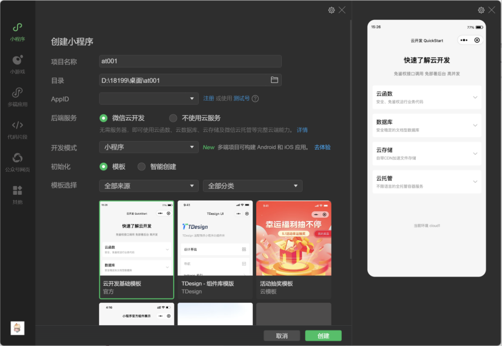
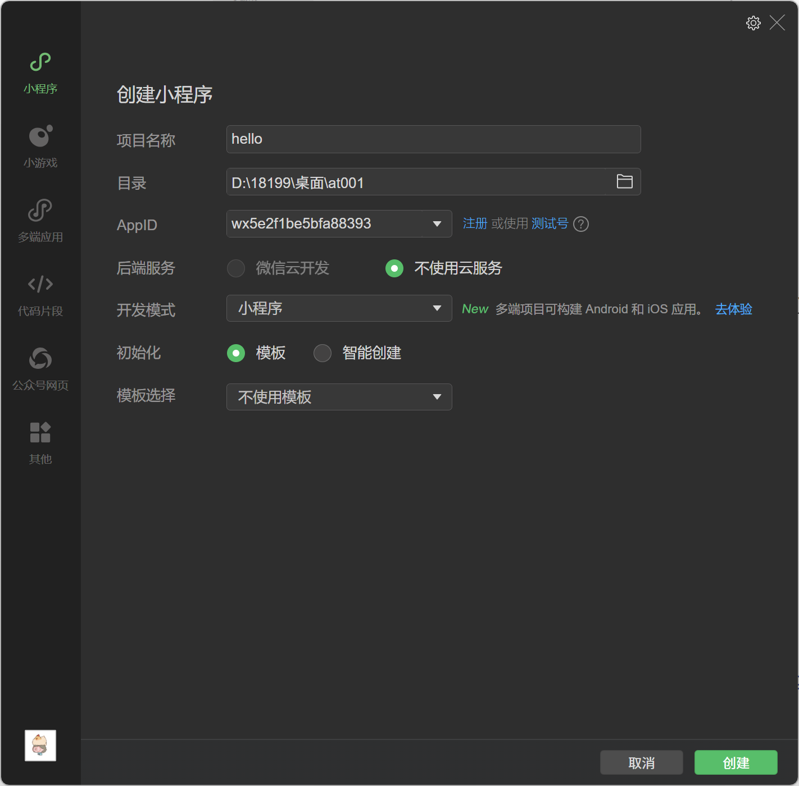
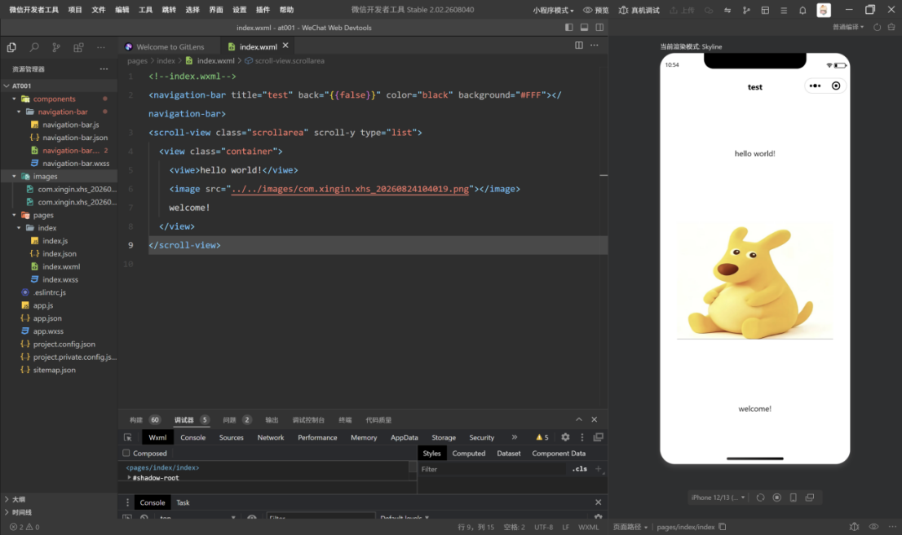
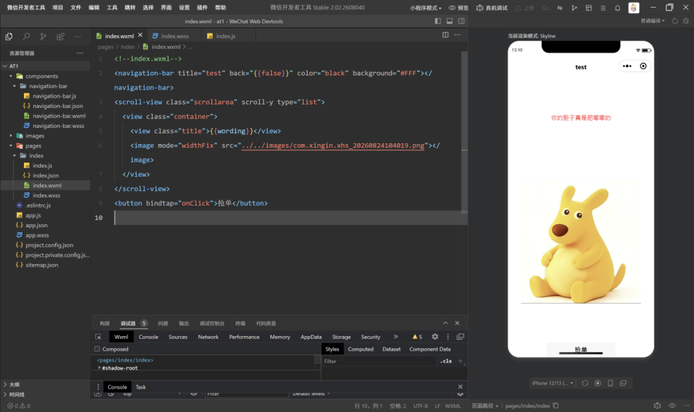
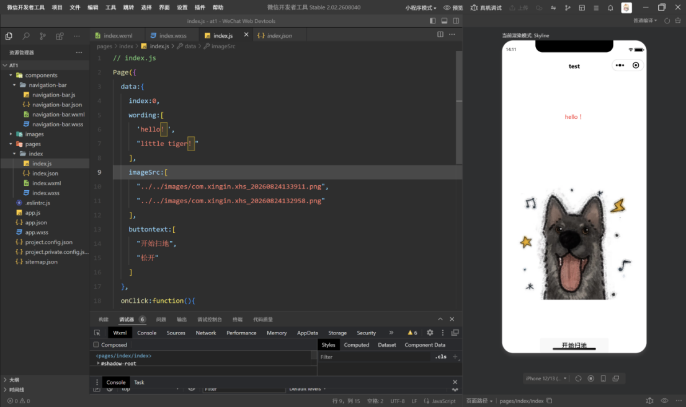
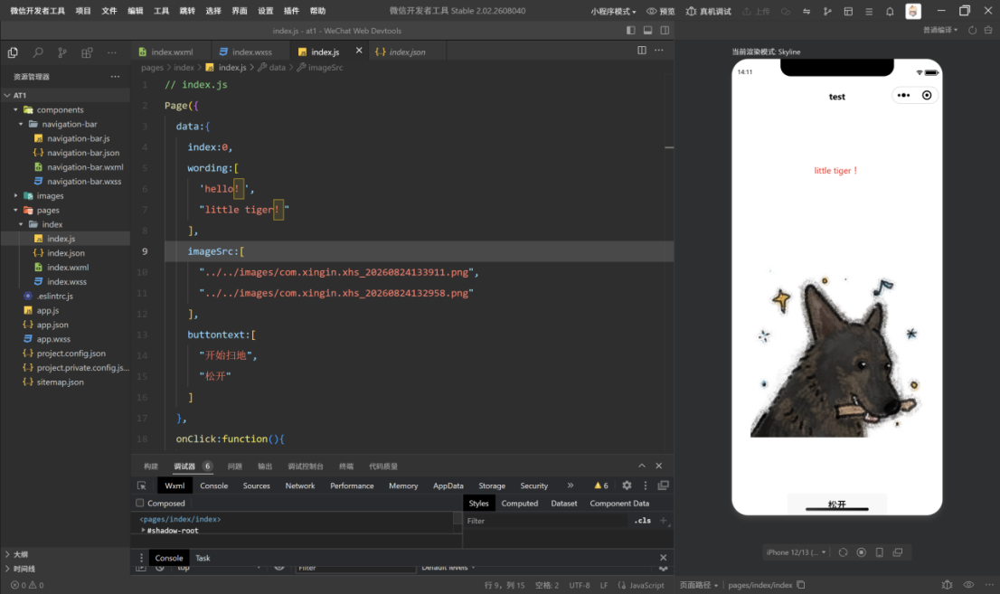
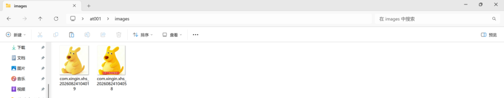
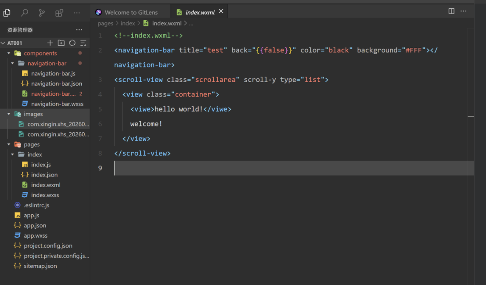

<center>姓名：石晗婷  学号：24020007103</center> 
| 姓名和学号         | 石晗婷，24020007103              |
| ------------------ | -------------------------------- |
| 本实验属于哪门课程 | 中国海洋大学26夏《移动软件开发》 |
| 实验名称           | 实验1：微信小程序                |
## 一、实验内容 

### 1、创建项目

首先创建自己的项目（不使用模板在模板选择的全部分类表中勾选）



### 2、编写代码

创建完成后根据教程视频编写基础代码，可以进行简单的切换（代码后续有修改，这里不展示基础代码）



### 3、改进

基础的代码只改变了文字，将wxml里图片的路径也修改为可变的之后就可以一起进行修改

实现的代码如下：

```
<!--index.wxml-->
<navigation-bar title="test" back="{{false}}" color="black" background="#FFF"></navigation-bar>
<scroll-view class="scrollarea" scroll-y type="list">
  <view class="container">
    <view class="title">{{wording[index]}}</view>
    <image mode="widthFix" src="{{imageSrc[index]}}"></image>
  </view>
</scroll-view>
<button bindtap="onClick">{{buttontext[index]}}</button>

```


刚才的代码只能进行一次切换，切换之后不能恢复。

实现思想：

提前将两个状态存在数组当中，通过改变index数字来实现状态的改变

以下是js的代码实现

```
// index.js
Page({
  data:{
    index:0,
    wording:[
      'hello！',
      "little tiger！"
    ],
    imageSrc:[
      "../../images/com.xingin.xhs_20260824133911.png",
      "../../images/com.xingin.xhs_20260824132958.png"
    ],
    buttontext:[
      "开始扫地",
      "松开"
    ]
  },
  onClick:function(){
    this.setData({
      index:1-this.data.index
    })
  }
})

```

实现效果如下图



## 二、问题总结与体会 描述实验过程中所遇到的问题，以及是如何解决的。有哪些收获和体会，对于课程的安排有哪些建议。

### 问题1：

新建images文件夹时不能从软件添加图片

解决办法：

将图片直接从本地复制到images文件夹中





### 问题2：

点击按钮之后图片只能切换一次，不能变回原来的状态

解决办法：

利用数组的思想，提前将两种状态储存在数组当中，只需要改变数组的索引就可以实现状态的切换

实现代码：

```
onClick:function(){
    this.setData({
      index:1-this.data.index
    })
  }
```

### 总结与体会

对开发者软件有了基本的了解：

Wxml 插入文字和图片进行渲染，调整图片的比例（一个骨架）

Wxss 调整布局以及具体细节

Js增加动态的改变，实现更多的想法

建议：可以多发散学生的思想，完成更多有创意的设计。